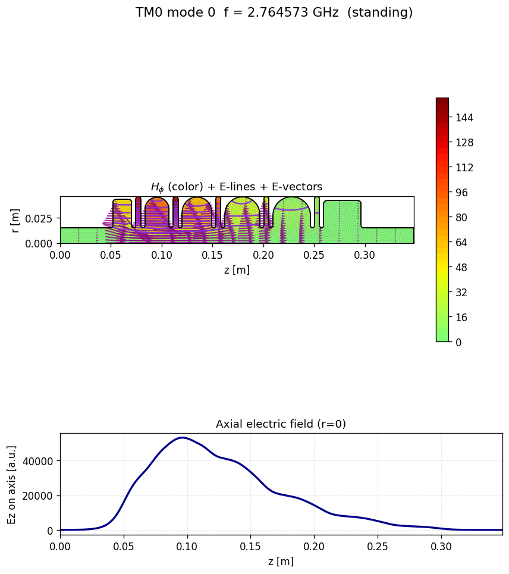
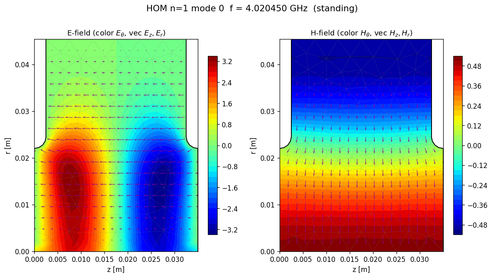
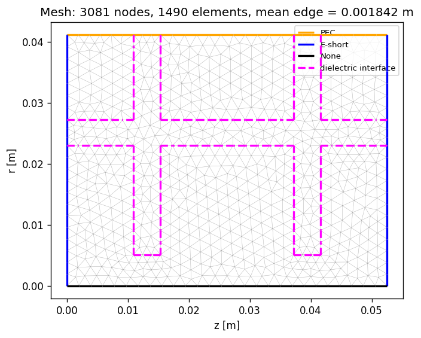

# AxiCavity-FEM

**軸対称 RF 空洞の共振モードを解く 2 次元有限要素法ソルバ — パラメトリックなスケッチ式 GUI、メッシュ生成、
後処理、3D 表示、レポート作成まで。**

[](LICENSE)
[](https://www.python.org/)
[](tests/)
[](https://github.com/TakuyaNatsui/AxiCavity-FEM/releases)

English README: [README.md](README.md)

解説動画（バージョン 2）: https://youtu.be/U27KQ3pV1wE



AxiCavity-FEM は回転体の (z, r) 半平面でヘルムホルツ方程式を解き、共振周波数・場の分布と、設計で実際に使う
工学量 — Q、R/Q、実効加速電圧、蓄積エネルギー、壁損失、パワーフロー、群速度、減衰定数 — を求めます。

加速に使う **軸対称 TM0 モード** と、ビーム不安定性の原因になる **高次方位角モード（HOM、n ≥ 1）** の両方を、
定在波としても、セル間の位相進みを与えた進行波としても計算できます。

**バージョン 3 の新しいところ:** GUI を全面的に作り直しました — 幾何拘束と寸法を持つパラメトリックな 2 次元スケッチ、
解析をすべて履歴として残すプロジェクト、3D 表示、コマンドラインと Python からのバッチ実行 — そして Python の
インストールが要らない **Windows 版（EXE）** を用意しました。計算コアはバージョン 2.3.0 と同じコードなので、
数値は変わりません。

---

## 特徴

**物理**

- 軸対称 **TM0** モード（H<sub>φ</sub> 定式化、節点要素）— 定在波・進行波
- 任意の方位角次数 n ≥ 1 の **高次モード**（電場定式化、辺要素）
- 任意の位相進みの **周期境界条件** と、分散曲線のための位相スキャン（`0:180:20`）
- **誘電体**: 領域ごとの比誘電率と **誘電正接 tanδ** による誘電体の Q（`1/Q = 1/Q_wall + 1/Q_diel`）
- 1 次・2 次の三角形要素

**得られる量**

| 量 | |
|---|---|
| f, Q, Q_wall, Q_diel | 共振周波数と Q 値 |
| R/Q, V_eff | シャントインピーダンスと実効加速電圧（与えた β の走行時間因子込み） |
| U, P_loss, P_diel | 蓄積エネルギー、壁損失、誘電体損失 |
| P_flow, v_g, α | ポートを通るパワーフロー、群速度、減衰定数（進行波） |

**作業の流れ**

- 作業の順に並んだ **リボン GUI**（PySide6）: モデリング → 物理 → メッシュ → 解析 → 結果
- **パラメトリックなスケッチ** — 線・長方形・円・円弧・多角形・フィレット。幾何拘束（一致・水平・接線・同心・対称 …）と
  寸法を [planegcs](https://github.com/Salusoft89/planegcs) で解く。パラメータ表（`a = 50`、`L = c/f/2`）で寸法や点の座標を
  動かせる。z 軸・r 軸は参照ジオメトリ
- **閉領域は自動で見つかる**。境界条件（PEC / E-short / M-short / None）は軸と内部の界面に自動で付き、曲線ごとに変えられる。
  領域ごとの材料（ε<sub>r</sub>、tanδ）
- **プロジェクト**（`.axiproj`）に形状・設定と、すべてのメッシュ・結果を履歴として保存。バージョン 2 の形状（`.gmshproj`）と
  **Superfish の `.af`** の取り込み・書き出し
- **結果**: 場の図、全工学量のモード表、ダブルクリックで場の値、進行波のアニメーション GIF、場のデータの書き出し
  （面・線・軸上）、HTML レポート
- **3D 表示**（pyvista）: 回転させた空洞の壁・子午面・横断面・切り欠き、場の矢印、TM0 の電気力線、HOM の cos(nφ) の模様、
  時間位相のアニメーション、PNG / GIF
- **バッチ実行** — GUI を使わずにパラメータを変えてプロジェクトを解析（コマンドライン `axicavity-fem-run` と Python）。
  パラメータスキャンや周波数合わせに
- 各段階の **コマンドライン**（`axicavity-fem solve | post | report | export | plot | info`）

| モデリング（パラメトリックなスケッチ） | 物理（境界条件と材料） |
|---|---|
|  |  |
| **結果** | **3D 表示** |
|  |  |

| 高次の双極モード（n = 1） | メッシュ・境界条件・誘電体の界面 |
|---|---|
|  |  |

---

## インストール

### Windows: EXE 版（Python 不要）

[Releases](https://github.com/TakuyaNatsui/AxiCavity-FEM/releases) から `AxiCavity-FEM-3.0.0-win64.zip` を取得して
好きな場所に展開し、`AxiCavity-FEM.exe` を起動します。フォルダの中身はまとめて使ってください。コード署名をしていないので、
初回に Windows の SmartScreen が出ることがあります（「詳細情報」→「実行」）。大きなメッシュ用の Intel MKL PARDISO と
3D 表示を含み、メッシュは同梱のメッシャ（gmsh）が作ります。同じ EXE でコマンドラインも使えます
（`AxiCavity-FEM.exe solve …`、`AxiCavity-FEM.exe run …`。zip の中の `README.txt`）。

### pip（Windows・Linux・macOS）

Python 3.10 以上が必要です。

```bash
git clone https://github.com/TakuyaNatsui/AxiCavity-FEM.git
cd AxiCavity-FEM
pip install -e ".[gui,viz3d]"     # ソルバ・コマンドライン・GUI・3D 表示
```

clone せずに GitHub から直接:

```bash
pip install "axicavity-fem[gui,viz3d] @ git+https://github.com/TakuyaNatsui/AxiCavity-FEM.git"
```

| extra | 追加されるもの |
|---|---|
| （なし） | ソルバとコマンドライン（`axicavity-fem`） |
| `gui` | GUI（`axicavity-fem-gui`）とバッチ実行（`axicavity-fem-run`）: PySide6、planegcs |
| `viz3d` | 3D 表示: pyvista、pyvistaqt |
| `accel` | Intel MKL PARDISO（`pypardiso`）: 大きなメッシュ（自由度約 2 万以上）の求解が数倍速くなる（結果は同じ） |
| `dev` | pytest、pytest-qt |

Gmsh は pip の依存として入るので、別途インストールは要りません。Linux では OpenGL のランタイム（`libglu1-mesa`）が
要ることがあります。

**2.3.0 からの更新:** パッケージ名は同じ（`axicavity-fem`）なので、バージョン 3 を入れると置き換わります。
コマンドライン `axicavity-fem` は同じで、`axicavity-fem-gui` は新しい GUI を起動します（wxPython は使いません）。
古い `.gmshproj` は「ファイル」→「取り込み」で開けます。

---

## クイックスタート

### GUI

```bash
axicavity-fem-gui          # または AxiCavity-FEM.exe
```

1. **モデリング** — (0, 0) から (100, 50) mm の長方形を描く（または「ファイル」→「取り込み」で [`samples/`](samples/) の
   サンプルを開く）。軸の上の角は自動で軸に拘束されます。
2. **物理** — 軸は `None`、ほかの壁は `PEC` に自動で決まります。
3. **解析** — 「解析実行」を押します。先にプロジェクトを保存し、結果はその中に残ります。
4. **結果** — モード表に TM<sub>010</sub> の f = 2.294851 GHz（解析解 `j₀₁c/2πa` と小数 6 桁まで一致）。同じタブから
   **3D 表示** を開けます。

[ユーザーマニュアル](USER_MANUAL.md) に 3 つのチュートリアルがあります。

### コマンドライン

[`samples/`](samples/) にサンプル形状があります。これは半径 50 mm・長さ 100 mm の円筒空洞（ピルボックス）です。
1 つのコマンドでメッシュを作り、モードを求め、工学量まで計算します:

```bash
axicavity-fem-run samples/cylinder100mm.gmshproj --modes 6 --out pillbox
```

できたメッシュ（`pillbox/model.msh`）で、各段階を個別に実行することもできます:

```bash
axicavity-fem solve  --type tm0 -m pillbox/model.msh --elem-order 2 --num-modes 6 -o pillbox.h5
axicavity-fem post   --type tm0 -i pillbox.h5 --cond 5.8e7
axicavity-fem report --type tm0 -i pillbox.h5 -o pillbox_report
```

`solve` がモードを求め、`post` が同じファイルに工学量を追記し（ここでは銅の壁、σ = 5.8 × 10⁷ S/m）、`report` が場の図入りの
HTML を作ります。各段階で HDF5 の隣にテキストの要約も書かれます。

高次モードは方位角次数を、進行波はセル間の位相進みを、周波数帯を探すときは目標周波数を指定します:

```bash
axicavity-fem-run samples/s-band_1cell.gmshproj --no-post --out sband
axicavity-fem solve --type hom -m sband/model.msh --az-order 0 1 2 -o hom.h5
axicavity-fem solve --type tm0 -m sband/model.msh -p 120 -o traveling.h5
axicavity-fem solve --type tm0 -m sband/model.msh --num-modes 4 --target-freq 2.856 -o sband.h5
```

オプションの一覧は `axicavity-fem <command> --help`。Windows 版では `axicavity-fem` の代わりに `AxiCavity-FEM.exe`、
`axicavity-fem-run` の代わりに `AxiCavity-FEM.exe run` を使います。

### Python からパラメータスキャン

GUI で保存したプロジェクトを、パラメータの値を変えて解析し直せます（値ごとにスケッチの拘束と寸法を解き直します）:

```python
from axicavity_fem.gui.batch import Project

p = Project.open("pillbox.axiproj")
for a in (40, 45, 50):
    p.set_params(a=a)
    r = p.run(post=False)
    print(a, r.frequencies()[0], "GHz")
```

---

## 精度

- **球形空洞と球ベッセル関数の解析解**: 最も細かいメッシュで相対誤差 ~1e-8、TM0・HOM とも収束次数 ≈ 4
  （[`examples/accuracy_verification/`](examples/accuracy_verification/)）
- **ピルボックス TM010**: `j₀₁c/2πa` と小数 6 桁まで一致
- **誘電体損失**: 一様に満たした空洞で `Q_diel = 1/tanδ` が機械精度で成り立ち、周波数は解析解の TM010 と 1.4e-7 で一致
  （[`examples/dielectric_loss/`](examples/dielectric_loss/)）
- **数値積分**: TM0 は既定で 7 点（5 次）の積分則。収束の調査
  （[`examples/quadrature_convergence/`](examples/quadrature_convergence/)）で、以前の 4 点則は 2 次要素の質量項を
  積分しきれず偽のモードを生むことが分かり、7 点則ではどのメッシュ密度でも出ない
- 返す固有対はすべて **残差を確認** するので、収束していないモードが偽の共振周波数として結果に出ることはない

設計には 2 次要素（`--elem-order 2`、GUI の既定）を使ってください。同じメッシュサイズで 1 次要素より 1〜2 桁精度が
高くなります。

---

## ドキュメント

| | |
|---|---|
| [USER_MANUAL.md](USER_MANUAL.md) | GUI・コマンドラインの全オプション・Python のバッチ API の説明 |
| [PHYSICS_AND_CONVENTIONS.md](PHYSICS_AND_CONVENTIONS.md) | 時間の規約、正規化、パワーフロー、周期境界の符号 |
| [docs/BC_NAMING.md](docs/BC_NAMING.md) | PEC / E-short / M-short / None の物理的な意味 |
| [docs/HDF5_SCHEMA.md](docs/HDF5_SCHEMA.md) | 出力ファイルの構成 |
| [docs/ARCHITECTURE.md](docs/ARCHITECTURE.md)、[docs/DEVELOPER_GUIDE.md](docs/DEVELOPER_GUIDE.md) | 開発者向け |
| [packaging/README.md](packaging/README.md) | Windows 版（EXE）の作り方 |
| [examples/](examples/) | 精度検証・周波数合わせ・パラメータスキャンのスクリプト |
| [CHANGELOG.md](CHANGELOG.md) | リリースノート |

---

## 以前のバージョン

バージョン 3 は、バージョン 2.3.0 の wxPython の GUI を上記の新しい GUI に置き換えたものです。計算コア
（`shared`・`physics_core`・`fem_tm0`・`fem_hom`・`reports`・`cli`）は同じコードで（違いは版番号の文字列だけ）、同じ
メッシュなら 2.3.0 と最後の桁まで同じ結果になります。バージョン 2.3.0 はタグ
[`v2.3.0`](https://github.com/TakuyaNatsui/AxiCavity-FEM/releases/tag/v2.3.0)、バージョン 1 はタグ
[`v1.0`](https://github.com/TakuyaNatsui/AxiCavity-FEM/releases/tag/v1.0) から取得できます。

---

## 引用

このコードを使った成果を発表するときは、次のように引用してください:

```bibtex
@software{AxiCavityFEM,
  author  = {Natsui, Takuya},
  title   = {{AxiCavity-FEM}: a 2-D axisymmetric finite-element solver for RF cavity resonant modes},
  version = {3.0.0},
  year    = {2026},
  url     = {https://github.com/TakuyaNatsui/AxiCavity-FEM}
}
```

## ライセンス

MIT — [LICENSE](LICENSE) を参照。

実行時に使うライブラリはそれぞれのライセンスに従います: **Gmsh** は GPL-2.0-or-later、**PySide6 / Qt** は LGPL-3.0、
**planegcs** は LGPL-2.1、pyvista・VTK は MIT / BSD、任意の **Intel MKL**（pypardiso 経由）は Intel Simplified Software License。
pip でこれらを入れても、このコードのライセンスは変わりません。

**Windows 版（EXE）** は Qt / PySide6 と planegcs（動的リンク。差し替え可能）、Intel MKL を同梱しています。メッシュ生成は
同梱の `mesher` フォルダの別プログラムで行います。これは Gmsh を含み、ソースコードと一緒に GPL で配布するもので、
本体とはファイルでやり取りするだけです。zip にライセンス表記の全文（`THIRD_PARTY_NOTICES.txt`）があります。

## 開発への参加

不具合の報告やプルリクエストは [GitHub Issues](https://github.com/TakuyaNatsui/AxiCavity-FEM/issues) へ。
プルリクエストの前にテストを実行してください:

```bash
pip install -e ".[gui,viz3d,dev]"
pytest
```

リポジトリに無い参照結果と比べるテストは、ファイルが無いときは skip されます。コードの構成は
[docs/ARCHITECTURE.md](docs/ARCHITECTURE.md)、開発者向けの詳しい説明は [docs/DEVELOPER_GUIDE.md](docs/DEVELOPER_GUIDE.md)。
