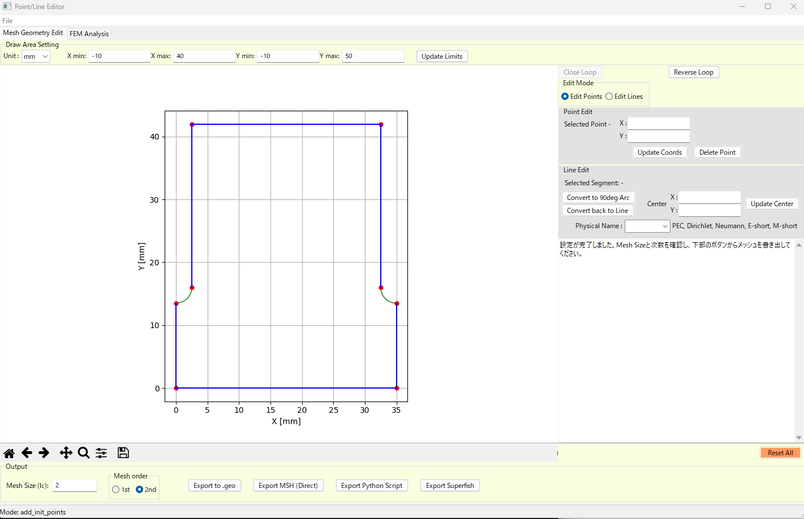
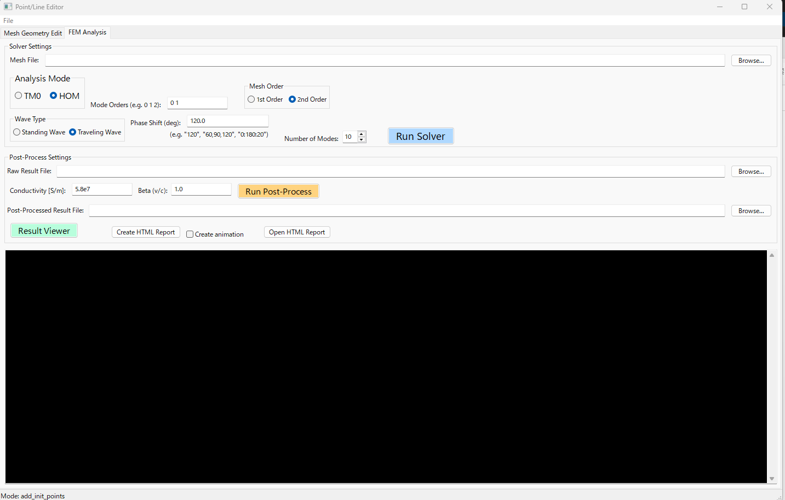
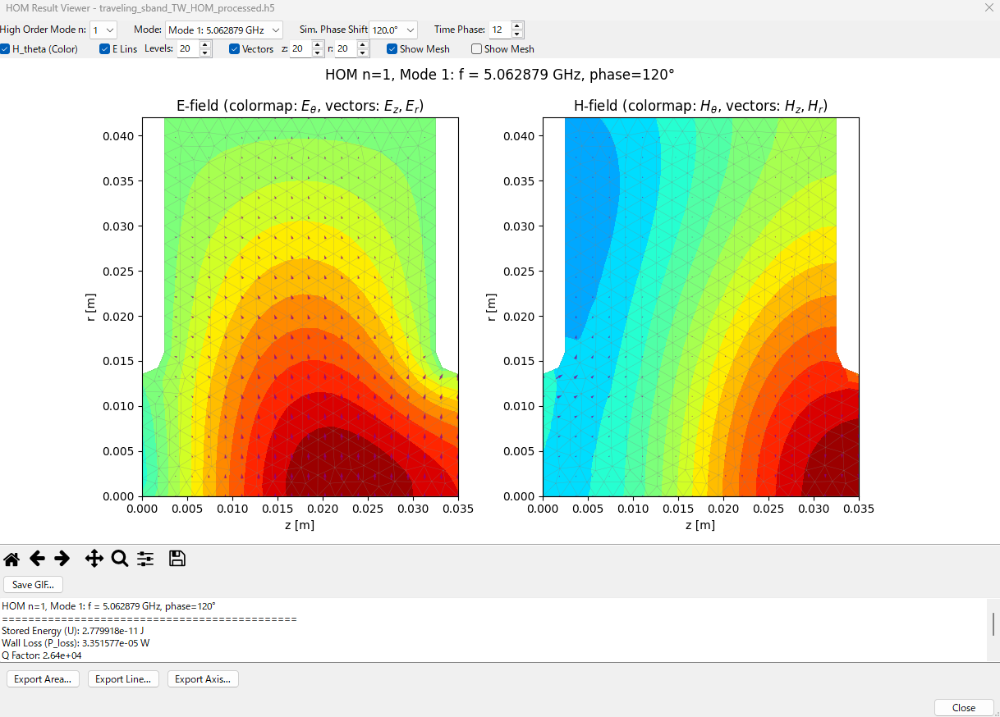
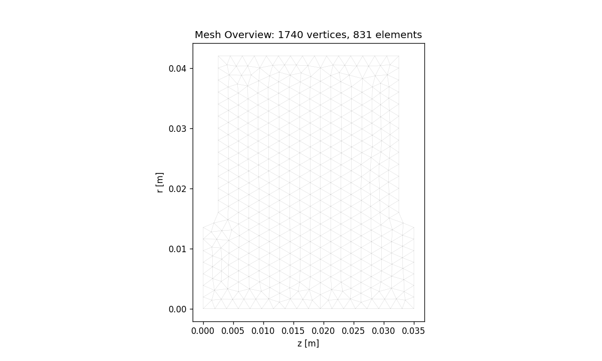
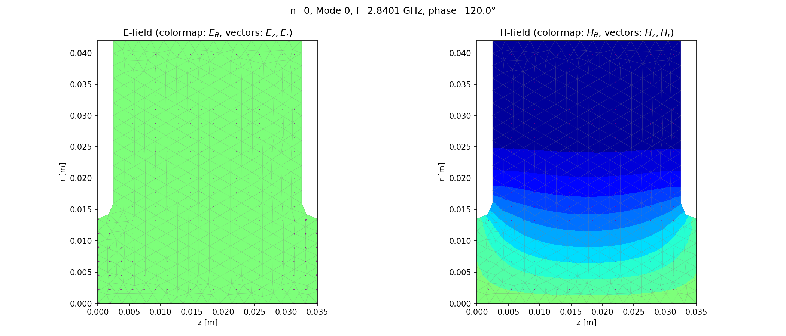
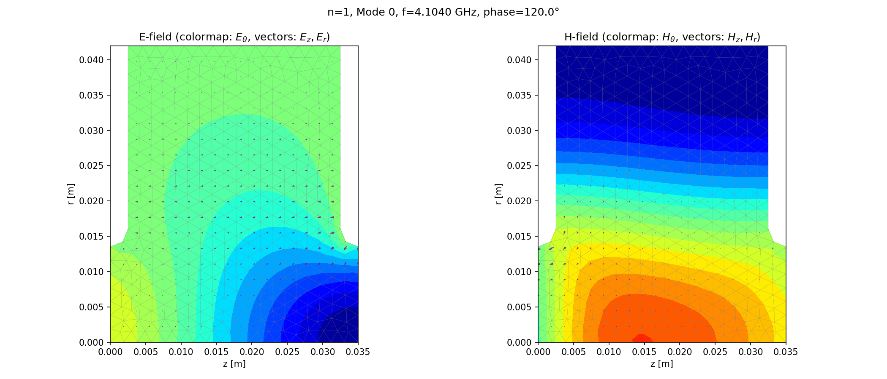
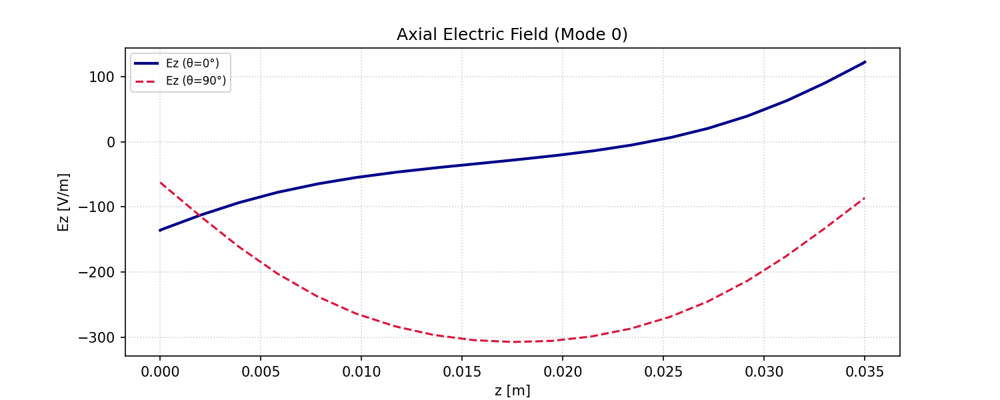

# AxiCavity-FEM

**2D Axisymmetric Electromagnetic FEM for Accelerator Cavity TM0 / HOM Analysis**

[English](README.md) | [日本語](README.ja.md)


AxiCavity-FEM solves the resonant modes of axisymmetric RF cavities by the finite element method. It supports the fundamental TM0 mode and arbitrary azimuthal-order higher-order modes (HOM), in both standing- and traveling-wave configurations, using high-accuracy 2nd-order Webb hierarchical edge elements. A wxPython GUI integrates Gmsh-based mesh generation, eigenmode solving, post-processing, and HTML/GIF reporting; an equivalent CLI is provided for batch use.

---

## Screenshots

### GUI workflow

<table>
  <tr>
    <td width="33%"></td>
    <td width="33%"></td>
    <td width="33%"></td>
  </tr>
  <tr>
    <td align="center"><sub>1. Shape &amp; Mesh editor</sub></td>
    <td align="center"><sub>2. FEM Analysis (Solver + Post-Process)</sub></td>
    <td align="center"><sub>3. Interactive Result Viewer</sub></td>
  </tr>
</table>

### Analysis outputs

<table>
  <tr>
    <td width="50%"></td>
    <td width="50%"></td>
  </tr>
  <tr>
    <td align="center"><sub>Mesh overview (S-band traveling-wave structure)</sub></td>
    <td align="center"><sub>TM0 traveling-wave E/H field at θ=120°</sub></td>
  </tr>
  <tr>
    <td width="50%"></td>
    <td width="50%"></td>
  </tr>
  <tr>
    <td align="center"><sub>HOM n=1 dipole mode (E/H field)</sub></td>
    <td align="center"><sub>On-axis E<sub>z</sub> profile (real / imaginary)</sub></td>
  </tr>
</table>

---

## Key Features

### Solvers
- **TM0 mode** — scalar $H_\phi$ formulation, standing & traveling waves
- **HOM (n ≥ 1)** — Nédélec edge DOF + nodal $E_\phi$ DOF, arbitrary azimuthal order, multiple `n` solved in one run
- **Webb hierarchical 2nd-order elements** — O(h⁴) convergence, < 0.01% frequency error on the spherical-cavity benchmark
- **Periodic-boundary phase scan** — automatic sweep of phase shift (e.g. `0:180:20`) for dispersion curves of traveling-wave structures

### Workflow
- **wxPython GUI** with integrated Gmsh mesh generation (shape editor → mesh → solve → view, all in one window)
- **Equivalent CLI** for scripted / batch runs; every GUI action logs the corresponding CLI command to `command.log`
- **Interactive Result Viewer** — colormaps, electric-field lines, vector plots, double-click to read field values at any point, GIF animation export of traveling-wave time evolution
- **HTML report** with engineering parameters: Q, R/Q, shunt impedance, group velocity, attenuation, plus per-mode field plots
- **Field map export** — Area / Line / Axis sampling, HDF5 + TXT output, complex amplitude or instantaneous real, optional power scaling for beam-dynamics input

---

## Installation

```bash
git clone https://github.com/TakuyaNatsui/AxiCavity-FEM.git
cd AxiCavity-FEM
pip install -r requirements.txt
```

**Requirements:** Python 3.10+ (3.10–3.13 supported via wxPython 4.2+).

**Notes:**
- All dependencies (including `wxPython` and `gmsh`) are pip-installable on Windows and Linux.
- A Conda environment is recommended on Linux to avoid wxPython build issues.
- Gmsh ships its Python bindings directly via PyPI — no separate Gmsh installation is required.

---

## Quick Start

### GUI

```bash
python app.py
```

Three-step workflow inside the GUI:

1. **Shape & Mesh tab** — sketch the cavity profile (points / arcs), set the mesh size, and export `.msh`.
2. **FEM Analysis tab** — choose TM0 or HOM, set element order (2nd recommended), number of modes, optional phase scan, then **Run Solver** → **Run Post-Process** → **Create HTML Report**.
3. **Result Viewer** — interactively browse modes; export field maps or GIF animations.

### CLI (TM0, standing wave example)

```bash
# Solve
python FEM_code/run_analysis.py \
    -m mesh_and_result/cylinder50mm_2nd.msh \
    --elem-order 2 --num-modes 5 -o result.h5

# Post-process & generate report
python FEM_code/post_process_unified.py -i result.h5 -c 5.8e7 -b 1.0
```

See [USER_MANUAL.md](USER_MANUAL.md) for full GUI walkthroughs and all CLI options (HOM solver, traveling-wave phase scan, field-map export, etc.).

---

## Project Structure

```
AxiCavity-FEM/
├── app.py                      # GUI entry point
├── MyFrame.py                  # Main GUI logic
├── ResultViewer.py             # Interactive result browser
├── plot_common.py              # Shared visualization utilities
├── FEM_code/                   # TM0 solver, post-process, field export
├── FEM_HOM_code/               # HOM (n ≥ 1) solver, post-process, field export
├── mesh_and_result/            # Sample meshes and report outputs
├── docs/images/                # README screenshots
└── USER_MANUAL.md              # End-user manual (Japanese)
```

---

## Documentation

| File | Purpose |
|------|---------|
| [USER_MANUAL.md](USER_MANUAL.md) | End-user operation guide (Japanese): GUI walkthrough, CLI reference, examples |
| [PHYSICS_AND_CONVENTIONS.md](PHYSICS_AND_CONVENTIONS.md) | FEM formulation, time convention $e^{+j\omega t}$, periodic BC sign, engineering parameters |
| [Helmholtz_2D_FEM.pdf](Helmholtz_2D_FEM.pdf) | Mathematical derivation of the axisymmetric Helmholtz FEM |
| [CLAUDE.md](CLAUDE.md) | AI agent project guidelines used during development |

---

## Accuracy Verification

Validated against the analytical eigenfrequencies of a spherical cavity (R = 100 mm). With 2nd-order elements, the error drops by 1–2 orders of magnitude versus 1st-order, and theoretical O(h⁴) convergence is observed.

| Mesh size | Element order | TM₀₁₁ error | TM₁₁₁ error | TE₁₁₁ error | TM₂₁₁ error |
|---|---|---|---|---|---|
| 10 mm (coarse) | 1st | ~ 1 % | ~ 0.1 % | ~ 0.1 % | ~ 0.1 % |
| 10 mm (coarse) | **2nd** | **0.12 %** | **0.0004 %** | **0.0014 %** | **0.0005 %** |
| 2.5 mm (fine) | 2nd | < 0.01 % | < 0.001 % | < 0.001 % | < 0.001 % |

See `PHYSICS_AND_CONVENTIONS.md` for the full formulation that delivers this accuracy.

---

## Citation

If you use AxiCavity-FEM in academic work, please cite:

```bibtex
@software{axicavity_fem,
  title  = {AxiCavity-FEM: 2D Axisymmetric Electromagnetic FEM for Accelerator Cavity TM0 / HOM Analysis},
  author = {Takuya Natsui},
  year   = {2026},
  url    = {https://github.com/TakuyaNatsui/AxiCavity-FEM}
}
```

---

## License

Released under the MIT License. See [LICENSE](LICENSE) for details.

Note: this project depends on wxPython (LGPL) and Gmsh (GPL with linking exception) at runtime via their Python bindings. The AxiCavity-FEM source code itself is MIT-licensed.

---

## Acknowledgments

Co-developed iteratively with **Claude (Anthropic)**. 
