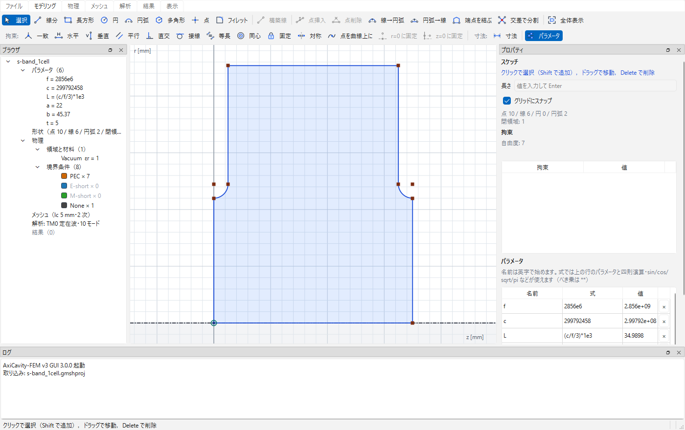
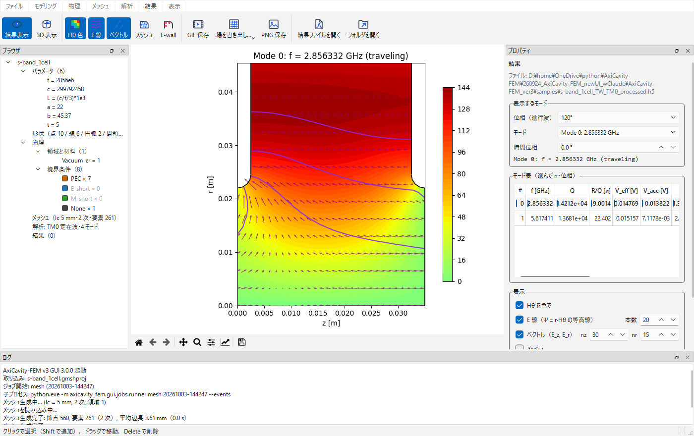
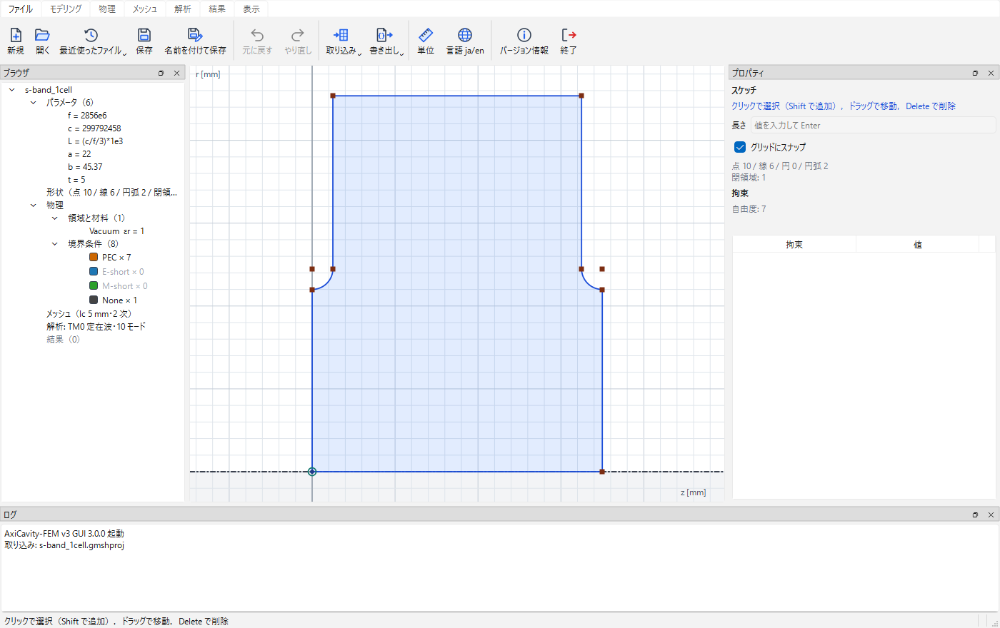
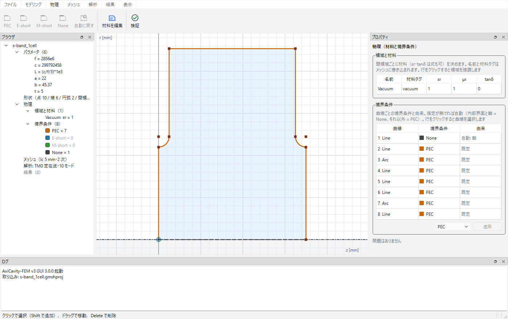
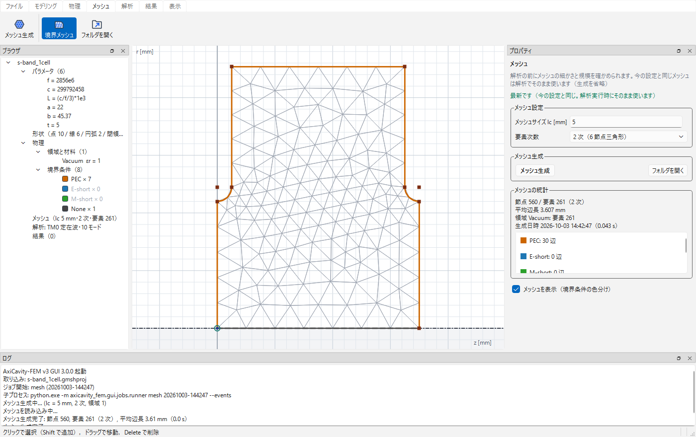
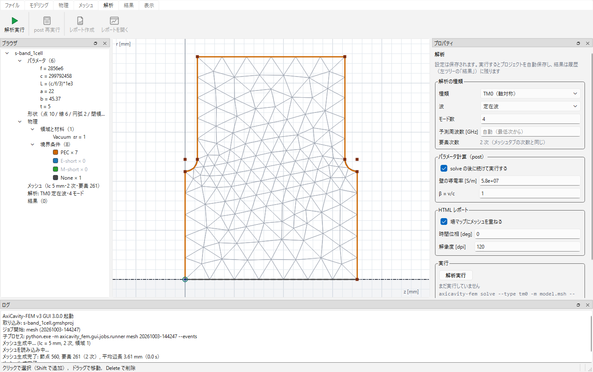
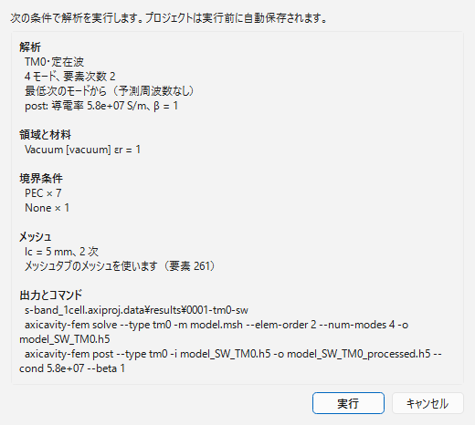
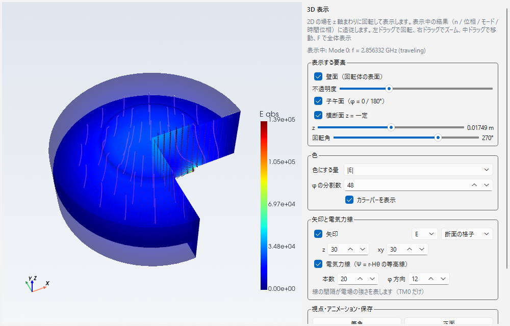

# AxiCavity-FEM ユーザーマニュアル（バージョン 3）

軸対称空洞共振器（加速空洞・ピルボックス・誘電体装荷空洞など）の共振モードを 2 次元有限要素法で解析するツールです。
軸対称 TM0 モードと高次方位角モード（HOM）を、定在波・進行波の両方で計算し、Q 値・R/Q・群速度などの工学パラメータ、
場の図、HTML レポート、場データの書き出しまでを 1 つの GUI で行えます。

バージョン 3 は **GUI を全面的に作り直した版**です。計算コア（固有値解析・後処理・レポート）はバージョン 2.3.0 と同じコードで
（違いは版番号の文字列だけ。`tests/test_core_identical.py` で確認）、数値結果は変わりません。コマンドライン
（`axicavity-fem`）の使い方も同じです。Python のインストールが要らない Windows 版（EXE）もあります（§1）。

> バージョン 2.3 の GUI（wxPython、Multi-Region Editor）をお使いだった方は §12「v2.3 からの移行」をご覧ください。
> バージョン 2.3 の形状（`.gmshproj`）はそのまま取り込めます。

---

## 目次

1. [インストールと起動](#1-インストールと起動)
2. [画面構成](#2-画面構成)
3. [チュートリアル 1: ピルボックス空洞](#3-チュートリアル-1-ピルボックス空洞)
4. [チュートリアル 2: 誘電体装荷空洞](#4-チュートリアル-2-誘電体装荷空洞)
5. [チュートリアル 3: 進行波（S バンド 1 セル）](#5-チュートリアル-3-進行波s-バンド-1-セル)
6. [リファレンス: ファイルタブとプロジェクト](#6-ファイルタブとプロジェクト)
7. [リファレンス: モデリングタブ](#7-モデリングタブ)
8. [リファレンス: 物理・メッシュ・解析タブ](#8-物理メッシュ解析タブ)
9. [リファレンス: 結果タブと表示タブ](#9-結果タブと表示タブ)
10. [コマンドライン（CLI）](#10-コマンドラインcli)
11. [Python からプロジェクトを解析する（batch）](#11-python-からプロジェクトを解析するbatch)
12. [v2.3 からの移行](#12-v23-からの移行)
13. [解析精度と注意事項](#13-解析精度と注意事項)

---

## 1. インストールと起動

### Windows 版（EXE。Python は不要）

1. GitHub の [Releases](https://github.com/TakuyaNatsui/AxiCavity-FEM/releases) から `AxiCavity-FEM-3.0.0-win64.zip`
   を取得し、好きな場所（例: `C:\Tools`）に展開します。
2. フォルダの中の `AxiCavity-FEM.exe` をダブルクリックすると GUI が起動します。初回に「Windows によって PC が保護
   されました」（SmartScreen）と出たら「詳細情報」→「実行」を押します（コード署名をしていないため）。
3. フォルダの中身はまとめて使います。`AxiCavity-FEM.exe` だけを別の場所へ移さないでください（ショートカットは可）。

EXE には大きなメッシュの求解を速くする Intel MKL PARDISO と 3D 表示が入っています。メッシュは同梱の `mesher` フォルダ
（gmsh を含む別プログラム）が作ります。同じ EXE でコマンドライン（§10）とバッチ実行（§11）も使えます。コマンド
プロンプトや PowerShell で EXE のフォルダから実行します:

```bat
AxiCavity-FEM.exe run samples\cylinder100mm.gmshproj           :: axicavity-fem-run と同じ（§11）
AxiCavity-FEM.exe solve --type tm0 -m model.msh -o result.h5     :: axicavity-fem と同じ（§10）
AxiCavity-FEM.exe version                                        :: 版と同梱物（PARDISO・メッシャ・3D 表示）
AxiCavity-FEM.exe selftest                                       :: 動作確認（円筒空洞を解いて解析解と比べる）
```

動かないとき・消すとき:

- 「VCRUNTIME140.dll が見つかりません」などと出たら、Microsoft Visual C++ 2015-2022 再頒布可能パッケージ（x64、
  <https://aka.ms/vs/17/release/vc_redist.x64.exe>）を入れてください。
- ウイルス対策ソフトが誤って検出することがあります（Nuitka で作った署名なしの EXE のため）。
- 報告は GitHub の Issues へ（`AxiCavity-FEM.exe selftest` の出力を添えてください）。
- アンインストールはフォルダの削除だけです。設定（表示言語・最近使ったファイル・ウィンドウ配置）はレジストリの
  `HKEY_CURRENT_USER\Software\AxiCavity-FEM` にあります。

### pip でインストール（Windows・Linux・macOS）

Python 3.10 以上が必要です。

```bash
git clone https://github.com/TakuyaNatsui/AxiCavity-FEM.git
cd AxiCavity-FEM
pip install -e ".[gui,viz3d]"
```

| extra | 追加されるもの |
|---|---|
| （なし） | ソルバとコマンドライン（`axicavity-fem`） |
| `gui` | GUI（`axicavity-fem-gui`）とバッチ実行（`axicavity-fem-run`）: PySide6、planegcs |
| `viz3d` | 3D 表示（§9）: pyvista、pyvistaqt。無くても GUI は動きます（3D 表示のボタンが無効になる） |
| `accel` | Intel MKL PARDISO（`pypardiso`）: 大きなメッシュ（自由度約 2 万以上）の求解が数倍速くなる（結果は同じ） |
| `dev` | テスト（pytest、pytest-qt） |

> バージョン 2.3.0 と同じパッケージ名（`axicavity-fem`）なので、入れると置き換わります。import 名 `axicavity_fem` も同じなので、
> 1 つの Python 環境に入れられるのはどれか 1 つの版です。

GUI の起動:

```bash
axicavity-fem-gui
axicavity-fem-gui mycavity.axiproj              # プロジェクトを開いて起動
axicavity-fem-gui old_project.gmshproj          # v2.3 の形状を取り込んで起動
axicavity-fem-gui result_SW_TM0_processed.h5    # 結果ファイルを結果タブで開いて起動
python -m axicavity_fem.gui [ファイル]           # 同じ
```

CLI（v2.3 と同じ。§10）とプロジェクトのバッチ実行（§11）:

```bash
axicavity-fem solve --type tm0 -m mesh.msh --elem-order 2 --num-modes 10 -o result.h5
axicavity-fem post  --type tm0 -i result.h5 --cond 5.8e7 --beta 1.0
axicavity-fem-run cav.axiproj --set a=45 --modes 4        # プロジェクトのパラメータを変えて解析（§11）
```

必要なもの: Python 3.10 以上、numpy / scipy / matplotlib / h5py / gmsh / Pillow（コア）、PySide6 / planegcs（GUI）。

---

## 2. 画面構成




| 場所 | 内容 |
|---|---|
| **リボン**（上） | 7 つのタブ: **ファイル / モデリング / 物理 / メッシュ / 解析 / 結果 / 表示**。作業の流れどおり左から右へ進みます。ボタンにマウスを乗せると説明とショートカットが出ます |
| **ブラウザ**（左） | プロジェクトの構成: パラメータ / 形状（点・線・円弧・閉領域の数）/ 物理（領域と材料、境界条件の本数）/ メッシュ / 解析 / 結果（履歴）。節をクリックすると対応するタブに切り替わります。結果を右クリックすると名前変更・フォルダを開く・削除 |
| **中央** | 2D スケッチ画面（横軸 z、縦軸 r。一点鎖線が対称軸 r = 0、r < 0 は網掛け）。物理タブでは曲線が境界条件の色になり領域が材料で塗り分けられ、メッシュタブではメッシュが重なります。結果タブでは場の図（matplotlib）に切り替わります |
| **プロパティ**（右） | タブに連動するパネル: スケッチ（ヒント・数値入力・選択した点の Z/R・拘束一覧・パラメータ表）/ 物理（領域表・境界条件表・検証）/ メッシュ（lc・次数・生成・統計）/ 解析（条件・post・レポート・コマンドのプレビュー）/ 結果（モード・モード表・表示オプション・場の値） |
| **ログ**（下） | 起動・取り込み・メッシュ生成・解析の進捗・CLI 相当のコマンド・エラー |
| **ステータスバー** | 操作のヒント、カーソルの z / r、選択した曲線の境界条件と由来 |

ドックはドラッグで動かせます。配置は終了時に保存され、表示タブの「レイアウトを初期状態に戻す」で戻せます。
言語はファイルタブの「言語 ja/en」で切り替えられます。

### 作業の流れ

```
モデリング（形を描く） → 物理（材料と境界条件） → メッシュ（確認は任意） → 解析（実行） → 結果（場・Q・R/Q）
```

メッシュタブでメッシュを作らなくても、解析のときに自動で作られます。メッシュタブは要素数・辺長・境界条件の
割り当てを先に確認したいときに使います（同じ設定なら解析で使い回されます）。

---

## 3. チュートリアル 1: ピルボックス空洞

長さ 100 mm、半径 50 mm の円筒空洞の TM010 モードを求めます（解析解 f = 2.2949 GHz）。

1. **モデリング**タブで「長方形」（キー `R`）を選び、画面で (0, 0) をクリック、次に (100, 50) をクリックします。
   右のパネルの「長さ」欄に数値を入れて Enter でも作図できます。グリッドにスナップするので端点は正確に置けます。
   ブラウザの「形状」が「点 3 / 線 4 / 閉領域 1」になれば OK です（閉領域は薄い青で塗られます。(0, 0) の角は
   参照の**原点**を共有するので点の数に入りません）。軸の上に置いた角 (100, 0) と (0, 50) には「軸の上」の拘束が
   自動で付きます（§7「原点と軸」）。
2. **物理**タブを開きます。曲線が色分けされます。軸上の線（r = 0）は自動で `None`（灰色）、それ以外は
   既定の `PEC`（橙）です。この例では何も変えなくて構いません。領域表には `Vacuum`（ε_r = 1）が自動で入っています。
3. **解析**タブで「解析実行」を押します。プロジェクトが未保存なら保存先を聞かれます（結果はプロジェクトの中に
   保存されるためです）。確認ダイアログに解析条件・領域・境界条件・メッシュ・出力先・実行コマンドが出るので
   「実行」を押します。ログに進捗が流れ、完了すると **結果**タブに切り替わって場の図が出ます。
4. 右のパネルのモード表で `#0` の f が 2.29 GHz 付近、Q が 1e4 台であることを確認します。行をクリックすると
   そのモードの図に変わります。図をダブルクリックするとその点の H_θ・E_z・E_r が出ます。
5. ファイルタブの「保存」（Ctrl+S）で保存します。左のブラウザの「結果 (1)」に `#1 TM0 定在波 — …` が残ります。

パラメトリックにするには、モデリングタブの「パラメータ」を押し、`L = 100`、`a = 50` を追加してから、点を選んで
右パネルの Z 欄に `L`、R 欄に `a` と入れて Enter を押します（式付きの点は四角で表示されます）。以後は
パラメータの値を変えると形が追従します。

---

## 4. チュートリアル 2: 誘電体装荷空洞

チュートリアル 1 の空洞の中に誘電体の円板（厚さ 10 mm、ε_r = 9.0、tanδ = 1e-4）を置きます。

1. モデリングタブで「線分」（`L`）を選び、(45, 0) → (45, 50)、(55, 0) → (55, 50) の 2 本を引きます。
   既存の辺に触れると自動で分割され（「交差で分割」）、閉領域が 3 つになります。
2. 物理タブで真ん中の領域をクリックし、「材料を編集」（または右パネルの領域表）で名前 `Ceramic`、
   材料タグ `ceramic`、ε_r `9.0`、tanδ `1e-4` を入れます。ε_r と tanδ には式（`eps_c` など）も使えます。
   領域の境目の線は自動で `None`（内部界面）になります（壁にはしません）。
3. 「検証」を押すと問題があれば教えてくれます（軸に接する領域が誘電体だと、V_eff・R/Q が不正確になる旨の警告が
   出ます。共振周波数・U・P_flow は正確です）。
4. 解析タブで実行します。結果タブのモード表に `Q_wall` と `Q_diel`、`P_diel` の列が増えます
   （1/Q = 1/Q_wall + 1/Q_diel）。図では誘電体の界面がマゼンタの破線で描かれます。

> tanδ は solve のときにメッシュに書き込まれます。tanδ を変えたら「post 再実行」ではなく「解析実行」で
> やり直してください。導電率 σ や β を変えただけなら「post 再実行」で十分です。

---

## 5. チュートリアル 3: 進行波（S バンド 1 セル）

同梱の `samples/s-band_1cell.gmshproj`（v2.3 のパラメトリック形状）を使います。

1. ファイルタブの「取り込み ▾」→「形状の取り込み」で `s-band_1cell.gmshproj` を開きます。パラメータ
   （`f`, `c`, `L`, `a`, `b`, `t`）と式付きの点がそのまま入ります。
2. 物理タブで両端の面（z = 0 と z = L の線）を選び、境界条件を `E-short`（青）にします。
   進行波では端面が PEC だと壁損失に数えられてしまうので、検証で警告が出ます。
3. 解析タブで「進行波」を選び、位相 `120`（1 セルあたりの位相進み [deg]。`60,90,120` や `0:180:20` も可）、
   モード数 `2` にして実行します。
4. 結果タブでは「時間位相」のスピンで瞬時場を回せます。「GIF 保存…」で時間位相 0→360° のアニメーションを
   保存できます（進捗ダイアログで中止できます）。モード表には群速度 v_g、減衰定数 α、P_flow が出ます。
5. HOM を見るには、解析タブで種類を `HOM`、方位角次数を `0 1 2` にして実行します。結果タブに `n` の選択が現れ、
   図は E_θ / H_θ の 2 パネルになります。



---

## 6. ファイルタブとプロジェクト



| ボタン | 内容 |
|---|---|
| 新規 (Ctrl+N) / 開く… (Ctrl+O) / 最近使ったファイル / 保存 (Ctrl+S) / 名前を付けて保存… (Ctrl+Shift+S) | プロジェクト `.axiproj` |
| 元に戻す (Ctrl+Z) / やり直し (Ctrl+Y) | 作図・拘束・パラメータ・物理設定のすべて |
| 取り込み ▾ | **形状の取り込み**（v2.x の `.gmshproj`）/ **Superfish 取り込み**（`.af`） |
| 書き出し ▾ | **形状の書き出し**（`.gmshproj`。v2.3 で開けます）/ **Superfish 書き出し** / **メッシュ書き出し**（`.msh` + `.materials.json`）/ **GEO 書き出し** / **Python 書き出し**（`build_model(**user_vars)` 付きのスクリプト） |
| 単位… | 座標の単位（m / cm / mm / inch）。「数値を換算する」か「ラベルだけ変える」かを選べます（式を持つ点は換算しません） |
| 言語 ja/en | 表示言語 |
| バージョン情報 | 版と同梱物（PARDISO・メッシュ生成の方式・3D 表示）、ライセンス、GitHub へのリンク。「情報をコピー」で不具合報告に貼れます |
| 終了 (Ctrl+Q) | 未保存なら 保存 / 破棄 / キャンセル を聞きます。解析の実行中は確認します |

### プロジェクトの形式

```
mycavity.axiproj                 マニフェスト（JSON: 形状・パラメータ・物理・メッシュ・解析の設定）
mycavity.axiproj.data\
    command.log                  実行した CLI 相当のコマンド（そのまま再実行できます）
    mesh\<日時>\                 メッシュタブで作ったメッシュ（model.msh, model.materials.json, …）
    results\0001-tm0-sw\         解析結果（番号-種類。tm0-sw / tm0-tw / hom-sw / hom-tw）
        job.json, geometry.json, model.msh, model.materials.json
        model_SW_TM0.h5 / .txt                 solve の出力（v2.3 と同じ形式）
        model_SW_TM0_processed.h5 / .txt       post の出力
        model_SW_TM0_processed_report\index.html
        exports\                               場の書き出し
        result.json, log.txt
    exports\
```

結果は履歴としてすべて残ります。ブラウザの結果に「形状変更前」「メッシュ変更前」「設定変更前」と出るのは、
その結果を出した後に形状や設定を変えたという印です（結果自体は変わりません）。2 つのフォルダを一緒に
コピーすれば別の PC でも開けます。

Superfish の書き出しは領域が 1 つ・穴なし・閉じた輪郭のときだけ可能です（`.af` には境界条件が入りません）。

---

## 7. モデリングタブ

上段が作図・編集、下段が拘束・寸法・パラメータです。

### 作図ツール（上段）

| ボタン | キー | 操作 |
|---|---|---|
| 選択 | `S` | クリックで選択（Shift で追加）、ドラッグで移動、`Delete` で削除。線・円弧をダブルクリックすると点を挿入 |
| 線分 | `L` | クリックで点をつないでいきます。始点に戻ると閉じます。`Enter` / 右クリックで終了、`Esc` で取り消し |
| 長方形 | `R` | 対角の 2 点 |
| 円 | `C` | 中心と半径 |
| 円弧 | `A` | 中心 → 始点 → 終点 |
| 多角形 | `P` | 中心と半径（辺の数は右パネル） |
| 点 | | 点だけを置く |
| フィレット | | 角の 2 本の線をクリック（半径は右パネル） |
| 構築線 | | 選んだ線・円・円弧を構築ジオメトリ ⇄ 通常 に切り替え（構築ジオメトリは閉領域に使われません） |
| 点挿入 / 点削除 | | 選んだ曲線の中点に点を挿入 / 選んだ点を消して前後を直線でつなぐ |
| 線→円弧 / 円弧→線 | | 選んだ線を 90° の円弧に / 円弧を直線に（境界条件は引き継ぎます）。何も選ばずに押すとボタンが押されたままになり、クリックした線（円弧）をその場で変換します（続けて何本でも。`Esc` で選択ツールに戻る）。変換した円弧は選択状態になるので、膨らむ向きは右パネル「選択した円弧の中心」の「向きを反転」ですぐ反対側にできます |
| 端点を結ぶ | | 開いた折れ線の両端を直線で結ぶ |
| 交差で分割 | | 交差・接触している曲線を交点で分割（作図のたびに自動でも行われます） |
| 全体表示 | `F` | 形状全体を画面に収める |

画面の操作: ホイールでズーム、中ボタンのドラッグでパン。座標は右パネルとステータスバーに出ます。
数値入力: 右パネルの「長さ」欄に数値を入れて Enter（線の長さ、円の半径など）。「グリッドにスナップ」で格子に吸着します。
多角形の「辺の数」とフィレットの「半径」は、そのツールを選んでいるときだけ右パネルに出ます。

### 拘束・寸法・パラメータ（下段）

下段は「拘束:」「寸法:」の見出しで区切られています。拘束は planegcs（FreeCAD の幾何拘束ソルバー）で解かれます。一致 / 水平 / 垂直 / 平行 / 直交 / 接線 / 等長 / 同心 /
固定 / 対称 / 点を曲線上に、続いて **r=0 に固定 / z=0 に固定**（次の「原点と軸」）、そして寸法（半径・距離・角度・長さ）があります。ボタンを押してから対象をクリックします
（必要な対象はツールチップとステータスバーに出ます）。矛盾する拘束は拒否され、右パネルの拘束一覧に自由度が出ます。

「寸法」はクリックする要素の組み合わせで種類が決まります。値は測った値で付き、拘束一覧の行や画面の寸法の数字を
ダブルクリックして変えられます（パラメータの式も可）。

| クリック | 寸法 |
|---|---|
| 点 → 点 | 2 点の距離 |
| 点 → 線（線 → 点） | 点と直線の距離 |
| 線 → `Enter` / 右クリック / 空白クリック | 線の長さ |
| 線 → 線 | 角度（平行なら 2 直線の間の距離） |
| 円 / 円弧 → `Enter` / 右クリック / 空白クリック | 半径 |
| 円 / 円弧 → 線（線 → 円 / 円弧） | 円周と直線の距離（中心と直線の距離 − 半径。直線が円を横切っているときは内側の隙間）。半径を変えても隙間が保たれます。円弧は円弧を含む円で測ります |

z 軸・r 軸も「線」として選べます（点と軸の距離 = r 座標や z 座標の寸法、円周と軸の隙間など）。
拘束一覧には何に付いた拘束かが出ます（`点を曲線上に（P3 – z 軸）` など。P1, P2… は「点番号」表示と同じ番号、
L1 / A1 / C1 は線・円弧・円の番号）。

### 原点と軸（参照ジオメトリ）

スケッチには最初から次の 3 つの**参照要素**があります。消したり動かしたりはできず、点・線の数や閉領域、
メッシュには入りません。

| 要素 | 画面 | 使い方 |
|---|---|---|
| 原点 (0, 0) | 青緑の小さな輪 | スナップして曲線の端点にできます。原点を端点にした曲線はその端が原点に固定されます |
| z 軸（r = 0 の直線） | ふだんは描かない（拘束ツールで指すと一点鎖線で強調） | 拘束・寸法ツールの相手に選べます（一致・点を曲線上に・対称の軸・平行 / 直交・接線・点と直線の距離・角度）。線分ではなく無限の直線として効きます。等長には使えません |
| r 軸（z = 0 の直線） | 同上 | 同上 |

参照要素だけの拘束（z 軸に水平など）は付かず、ステータスバーにその旨が出ます。選択ツールでは参照要素は選べません
（z = 0 の線の近くをクリックしても軸ではなく利用者の線・領域が選ばれます）。

- **r=0 に固定 / z=0 に固定**: 選んだ点（線を選ぶと両端の点）に「点を曲線上に（z 軸 / r 軸）」の拘束を付けます。
  点は軸の上に移り、以後ドラッグしても**軸に沿って滑るだけで軸から外れません**。その座標の式は外れます
  （式と拘束がぶつかるため）。両端が同じ軸に乗った線の「水平」「垂直」は冗長になるので外れます。
- **作図の自動拘束**: 作図で新しくできた点が軸の上（スナップ許容の範囲）にあれば、同じ拘束が自動で付きます。
  原点をクリックした点は原点そのものになります。**Ctrl を押しながら**作図すると自動拘束は付きません。
- 軸の拘束を外すには、拘束一覧でその行を削除します。右パネルで軸の拘束が付いた座標（r = 0 の点の R など）に
  0 以外の値や式を入れても、その拘束は外れて点が軸から離れます。
- 同心・一致などを付けて軸の拘束が冗長になったとき（軸の上の円の中心を原点の円と同心にしたなど）は、
  軸の拘束のほうが自動で外れます。
- 以前のファイル（v3 の古い `.axiproj`、`.gmshproj`、Superfish）を開くと参照要素が足されますが、既存の点や式は
  そのままです（`R = 0` の式で軸に置いた点は式のまま）。形状のハッシュは変わらないので未保存にはならず、
  結果が「形状変更前」になることもありません。

**パラメータ**を押すと右パネルに `名前 | 式 | 値` の表が出ます。上の行から順に評価され、上の行の名前を下の行で使えます
（`L = (c/f/3)*1e3` など。べき乗は `**`、`sin`/`cos`/`sqrt`/`pi` などが使えます）。

式が使える場所: **点の Z / R**（点を選んで右パネル。`= 32.49` と評価値が出ます）、**円弧の中心 Z / R と半径**、
**寸法拘束の値**、**メッシュサイズ lc**、**領域の ε_r と tanδ**。式を持つ点は固定点として扱われ、四角のマーカーで表示
されます。式を持つ点をドラッグすると式は捨てられて数値になります（v2.3 と同じ）。

閉領域は自動で検出されます。線で仕切れば領域が増え、削除すれば減ります。領域の設定（材料）は編集後も
できるだけ同じ領域に引き継がれます。

---

## 8. 物理・メッシュ・解析タブ

### 物理



| ボタン | 内容 |
|---|---|
| PEC / E-short / M-short / None | 選んだ曲線に境界条件を割り当てる |
| 自動に戻す | 明示した境界条件を消して自動判定に戻す |
| 材料を編集 | 右パネルの領域表にフォーカス |
| 検証 | 形状・境界条件・材料の問題を一覧（解析実行の確認ダイアログにも出ます） |

境界条件は明示しないかぎり自動で決まります: **内部界面**（2 つの領域が共有する曲線）と **軸上の線**（r = 0）は `None`、
それ以外は `PEC`。右パネルの境界条件表とステータスバーに「由来」（指定 / 自動: 内部 / 自動: 軸 / 既定）が出ます。
色は v2.3 と同じ（PEC 橙 / E-short 青 / M-short 緑 / None 灰）。

| 境界条件 | 意味 | 使いどころ |
|---|---|---|
| `PEC` | 完全導体の壁（接線 E = 0）。壁損失に数えます | 空洞の壁 |
| `E-short` | 電気壁（接線 E = 0）の対称面。損失に数えません | 進行波の端面、E 対称面 |
| `M-short` | 磁気壁（接線 H = 0）の対称面 | H 対称面 |
| `None` | 何もしない（内部界面・軸・開口） | 領域の境目、軸 |

領域表: 名前 / 材料タグ（`[a-z0-9_]`。`PEC` など境界条件と同じ名前は不可）/ ε_r / μ_r / tanδ。既定は `Vacuum`（ε_r = 1）。
右パネルの「状態」に「孤立」と出た設定は、対応する閉領域が無くなったものです（書き出しには使われません）。

### メッシュ



| 項目 | 内容 |
|---|---|
| lc | 節点間隔（座標の単位。式可） |
| 次数 | 1 次 / 2 次。**メッシュの幾何次数 = 解析の要素次数**（v3 では 1 つの設定）。円弧を含む形状と HOM は 2 次を推奨 |
| メッシュ生成 / 中止 | 子プロセスで gmsh を実行。統計（節点・要素・平均辺長・境界条件ごとの辺・領域ごとの要素）が出ます |
| 境界メッシュ | メッシュをスケッチ画面に重ねる（境界条件の色、誘電体界面はマゼンタ） |
| フォルダを開く | 生成したメッシュのフォルダ |

形状や材料を変えると「要再生成」になり、解析のときに作り直されます。ファイルタブの「メッシュ書き出し」で
任意の場所に `.msh` + `.materials.json` を書けます（v2.3 の CLI でそのまま使えます）。

### 解析



| 項目 | 内容 |
|---|---|
| 種類 | `TM0`（軸対称）/ `HOM`（方位角次数 n を空白区切りで。例 `0 1 2`） |
| 波 | `定在波` / `進行波`（位相 [deg]: `120`、`60,90,120`、`0:180:20`） |
| モード数 | 求めるモードの数 |
| 予測周波数 [GHz] | 指定するとその周波数に近いモードから返します（shift-invert のシフト）。空欄なら最低次から |
| 要素次数 | メッシュタブの次数と同じ（表示のみ） |
| post | solve の後に続けて実行 / 壁の導電率 σ [S/m] / β = v/c（TM0） |
| HTML レポート | 進行波に GIF を付ける / メッシュを重ねる / 時間位相 / 解像度 |
| 実行 | CLI 相当のコマンドのプレビュー、検証結果、状態 |

| ボタン | 内容 |
|---|---|
| 解析実行 | 検証 → （未保存なら保存先）→ 確認ダイアログ → 自動保存 → 子プロセスで（メッシュ →）solve → post |
| キャンセル | 段階の切れ目（メッシュ → solve → post）で止めます。固有値計算の途中では止まりません |
| 強制停止 | 子プロセスを直ちに終了（結果は残りません。確認あり） |
| post 再実行 | 表示中の結果に σ・β を変えて post をやり直す（結果は更新されます） |
| レポート作成 / レポートを開く | `…_report/index.html`（図・表・進行波の GIF） |



実行したコマンドはログと `command.log` に `[0001-tm0-sw] axicavity-fem solve …` の形で残ります。結果フォルダで
そのまま再実行できます。

---

## 9. 結果タブと表示タブ

### 結果

| ボタン | 内容 |
|---|---|
| 結果表示 | 中央を場の図にする（結果タブを開くと自動） |
| Hθ 色 / E 線 / ベクトル / メッシュ / E-wall | 表示の切替（E 線と E-wall は TM0 だけ） |
| GIF 保存… | 進行波の時間位相 0→360° のアニメーション（フレーム数・fps） |
| 場を書き出し… ▾ | 領域（格子）/ 直線 / 軸 r=0 でサンプリングして h5 / txt に書く（§10 の `export` と同じ。目標壁損失で
  スケーリング、進行波の瞬時値、倍率、形式）。結果フォルダの `exports\` に入り、コマンドは `command.log` に残ります |
| PNG 保存… | 今の図を PNG に |
| 3D 表示 | 回転体の 3D 表示を別ウィンドウで開く（下の「3D 表示」） |
| 結果ファイルを開く… | プロジェクト外の h5（CLI や v2.3 の出力）を開く |
| フォルダを開く | 表示中の結果のフォルダ |

右パネル: 方位角次数 n（HOM）/ 位相（進行波）/ モード / 時間位相（進行波）、モード表
（# / f / Q / Q_wall / Q_diel / R/Q / V_eff / V_acc / U / P_loss / P_diel / P_flow / v_g / α / v_ph のうち結果にある列。
行をクリックするとそのモード）、表示オプション（E 線の本数、ベクトルの格子 nz × nr）、場の値（図をダブルクリック）。

図の見方（TM0）: 色は H_φ、青紫の線は電気力線（Ψ = r·H_φ の等高線）、矢印は (E_z, E_r)、黒の太線は PEC、
マゼンタの破線は誘電体の界面、赤の矢印（E-wall）は PEC 上の電場。HOM は左が E（色 E_θ、矢印 E_z, E_r）、
右が H（色 H_θ、矢印 H_z, H_r）。単位は m。

解析が完了すると自動でその結果が表示されます。ブラウザの「結果」から過去の結果を選べます。

### 3D 表示（pyvista）



結果タブの **「3D 表示」** で別ウィンドウが開き、2D の場を z 軸まわりに回転した立体で表示します（TM0 / HOM、定在波 /
進行波のどれでも）。pip 版は `pip install -e ".[viz3d]"`（pyvista と pyvistaqt）が必要で、無ければボタンは無効になります（Windows 版には入っています）。
表示中の結果（n / 位相 / モード / 時間位相）に自動で追従し、2D の図と並べて見られます。

| 項目 | 内容 |
|---|---|
| 壁面 | 空洞の壁を回転させた面（半透明。不透明度のスライダ）。壁面上の場の色 |
| 子午面 | φ = 0 と 180° の断面（2D の図を 3D に置いたもの）。回転角を 360° 未満にすると切り欠きの面になります |
| 横断面 z = 一定 | スライダで z を動かして輪切りにします。HOM では cos(nφ) の模様が見えます |
| 回転角 | 30〜360°。360° 未満で扇形の切り欠きにして内部を見せます |
| 色にする量 | \|E\|（既定）/ E_z / E_r / E_φ / \|H\| / H_z / H_r / H_φ。範囲は振幅の最大で固定なのでアニメーションで揺れません |
| φ の分割数 | 回転体の細かさ（既定 48。HOM の n が大きいときや滑らかにしたいときは増やす。大きなメッシュでは減らす） |
| 矢印 | E または H の矢印を直交格子の点に置きます（メッシュの節点ではなく、格子点で場を補間）。「断面の格子」は表示している子午面（z × r）と横断面（x × y）の上、「体積の格子」は x × y × z の格子。分割数は z と xy で別々に指定（既定 30 / 30。子午面では r 方向はその半分）。長さは大きさに比例 |
| 電気力線（TM0） | 2D の E 線（Ψ = r·H_θ の等高線）を φ 方向に指定の本数だけ並べます。線の間隔が電場の強さを表します |
| 等角 / 正面 / 上 / 横 | 視点。マウスの左ドラッグで回転、右ドラッグでズーム、中ドラッグで移動、`F` で全体表示 |
| 再生 / 停止 | 進行波の時間位相を 0→360° で回します（HOM では回転するモードが見えます） |
| PNG 保存… / GIF 保存… | 3D ビューを PNG に、進行波のアニメーションを GIF に（フレーム数と fps。今の視点のまま） |

HOM の φ 依存は e^{jnφ} の規約で、E_z・E_r・H_φ が cos(nφ)、E_φ・H_z・H_r が sin(nφ) です（定在波は φ = 0 に E_z の
腹がある向き。縮退したモードの向きは任意です）。

### 表示

全体表示 / 軸範囲…（z と r の表示範囲を数値で。空欄で全体）/ グリッド / 点番号 / 境界条件の色（モデリングタブでも
色分け）/ レイアウトを初期状態に戻す。

---

## 10. コマンドライン（CLI）

CLI は v2.3 と同じです（コマンド名 `axicavity-fem`）。GUI が内部で実行しているコマンドは `command.log` にあり、
結果フォルダを作業フォルダにすれば同じコマンドで再実行できます。

```bash
# 定在波 TM0（2 次要素・10 モード）
axicavity-fem solve --type tm0 -m model.msh --elem-order 2 --num-modes 10 -o model_SW_TM0.h5
# 予測周波数の近くから
axicavity-fem solve --type tm0 -m model.msh --elem-order 2 --num-modes 4 --target-freq 2.856 -o band.h5
# HOM（方位角次数 0 / 1 / 2）
axicavity-fem solve --type hom -m model.msh --elem-order 2 --num-modes 10 --az-order 0 1 2 -o model_SW_HOM.h5
# 進行波（位相 120°。スキャンは "0:180:20"）
axicavity-fem solve --type tm0 -m model.msh --elem-order 2 --num-modes 10 -o model_TW_TM0.h5 -p 120
# ポストプロセス（Q, R/Q, V_eff, U, P_loss, P_flow, 群速度, 減衰）
axicavity-fem post --type tm0 -i model_SW_TM0.h5 -o model_SW_TM0_processed.h5 --cond 5.8e7 --beta 1
# HTML レポート（進行波に GIF を付けるなら --animate）
axicavity-fem report --type tm0 -i model_SW_TM0_processed.h5 -o model_SW_TM0_processed_report
# 場マップ（矩形領域・1 kW 壁損失にスケーリング）
axicavity-fem export --type tm0 -i model_SW_TM0_processed.h5 -o field_area --shape area --z-range 0,0.1 --r-range 0,0.05 --nz 200 --nr 100 --scale-to-power 1000
# 軸上（進行波の瞬時値、時間位相 30°）
axicavity-fem export --type tm0 -i model_TW_TM0_processed.h5 -o field_axis --shape axis --npts 500 --phase 120 --instant --time-phase 30
# PNG
axicavity-fem plot --type tm0 -i model_SW_TM0.h5 -m 0 -o map.png
# HDF5 の構造
axicavity-fem info -i model_SW_TM0.h5
```

誘電体を含むメッシュは `.msh` と同名の `.materials.json`（ファイルタブの「メッシュ書き出し」が作ります）を
`solve` が自動で読みます（`--materials` で明示も可）。

### `.axiproj` から直接解析する

GUI で作ったプロジェクトのパラメータを変えて解析する（スキャン・合わせ込み）には `axicavity-fem-run` と Python の `axicavity_fem.gui.batch` を使います。§11 を見てください。

### 位相の指定（`-p/--phase`）

| 指定 | 例 | 意味 |
|---|---|---|
| 単一値 | `-p 120` | 120° |
| 列挙 | `-p "60,90,120"` | 3 点 |
| レンジ | `-p "0:180:20"` | 0° から 180° を 20° 刻み |

`-p 0`（または省略）で定在波、それ以外で進行波です。

### テキスト出力

`solve` / `post` は HDF5 の隣に同名の `.txt`（解析条件と各モードの周波数、post では Q・R/Q・V_eff・U・P_loss・P_flow・
群速度・減衰定数）を書きます。GUI の結果フォルダにも同じものが入ります。

### 場データの書き出し（`export`）

| `--shape` | 内容 | 引数 |
|---|---|---|
| `area` | 矩形領域の格子 | `--z-range`, `--r-range`, `--nz`, `--nr` |
| `line` | 2 点を結ぶ直線 | `--p1 z,r`, `--p2 z,r`, `--npts` |
| `axis` | 軸 r = 0 上 | `--z-range`, `--npts` |

共通: `--scale-to-power P`（壁損失が P [W] になるようにスケーリング。post 済みが必要）、`--scale`（倍率）、
`--instant`（進行波の TM0 で瞬時実数値。既定は複素振幅）、`--time-phase`、`--format {h5,txt,both}`。
HDF5 の `attrs` にメタデータ（周波数・位相・スケール …）、TXT は `#` ヘッダに同じ内容と列名が入ります。

---

## 11. Python からプロジェクトを解析する（batch）

GUI で作ったプロジェクト（`.axiproj`）を、GUI を開かずに Python やコマンドラインから解析できます。パラメータ表の値を
変えると、式付きの点と寸法拘束を GUI と同じ手順で解き直してからメッシュを作ります。そのため、GUI で作図・拘束した形状の
**パラメータスキャン**や**目標周波数への合わせ込み**をスクリプトで書けます。

| 目的 | 使うもの |
|---|---|
| パラメータを変えて周波数・Q を調べる（スキャン・最適化） | この章の `axicavity_fem.gui.batch`（Python）/ `axicavity-fem-run`（コマンドライン） |
| 手元の `.msh` をそのまま解く | §10 の `axicavity-fem solve / post` |
| gmsh のスクリプトとしてメッシュを作る | ファイルタブの「Python 書き出し」（`build_model(**user_vars)`）。ただし GUI で作図・拘束した点は planegcs が解いた数値で出るので、パラメータが効くのは `.gmshproj` から取り込んだ式付きの点だけです |

計算は GUI の「解析実行」と同じ経路（`.axiproj` の形状 → gmsh でメッシュ → `solve` →（`post`））で、同じ数値になります。
GUI の子プロセスとは違い、Python を実行しているプロセスの中で計算します。

### 11.1 最初の例

```python
from axicavity_fem.gui.batch import Project

p = Project.open("cav.axiproj")      # GUI で保存したプロジェクト
print(p.params)                      # {'L': '100', 'a': '50'}  パラメータ名 → 式
p.set_params(a=45)                   # パラメータ a を 45 に（形状が追従する）
p.analysis.numModes = 4              # 解析の設定もそのまま変えられる
r = p.run()                          # メッシュ → solve → post
print(r.frequencies())               # [2.5498 2.9578 3.9357 5.1696]  共振周波数 [GHz]
print(r.values("Q"))                 # Q（post の値）
print(r.dir)                         # 結果のフォルダ（h5 / txt）
```

`p.run()` は元の `.axiproj` を書き換えません。変えた状態を残したいときは `p.save_as("cav_a45.axiproj")` で別名に保存します。

### 11.2 コマンドライン `axicavity-fem-run`

Python を書かずに 1 回の解析をするときに使います（`python -m axicavity_fem.gui.batch` も同じです）。

```bash
axicavity-fem-run cav.axiproj                              # そのまま解析（メッシュ → solve → post）
axicavity-fem-run cav.axiproj --set a=45 --set t=6 --modes 4 --json out.json
axicavity-fem-run cav.axiproj --type hom --az-order 0 1 --wave traveling --phases 120 --no-post
axicavity-fem-run cav.axiproj --info                       # パラメータと設定を表示するだけ
axicavity-fem-run cav.axiproj --set a=45 --save-as cav_a45.axiproj --no-run
axicavity-fem-run old.gmshproj --modes 2                   # v2.x の形状ファイルも可
```

| オプション | 内容 |
|---|---|
| `--set NAME=EXPR` | パラメータの式（数値または式。複数回指定できる。`--set L="(c/f/3)*1e3"` のように式は引用符で） |
| `--type tm0\|hom`、`--az-order 0 1 …` | 解析の種類と HOM の方位角次数 |
| `--wave standing\|traveling`、`--phases 120` | 定在波 / 進行波と位相 [deg]（`"60,90"`、`"30:180:30"` も可） |
| `--modes N`、`--target-freq F` | モード数、予測周波数 [GHz] |
| `--no-post`、`--cond S`、`--beta B` | post を実行しない、壁の導電率 [S/m]、β = v/c |
| `--lc L`、`--order 1\|2` | メッシュサイズ（座標の単位）、メッシュ次数 = 要素次数 |
| `--out DIR` | 出力フォルダ（省略時は §11.5 の既定） |
| `--register` | GUI の結果履歴（`results\NNNN-<種類>\`）に登録する |
| `--json FILE` | 結果（§11.6 の `RunResult` の内容）を JSON で書く |
| `--save-as FILE` | 変えた状態を別名の `.axiproj` に保存する（`--no-run` と組み合わせると保存だけ） |
| `--info` | パラメータ（式と値）と設定を表示して終わる |
| `--quiet` / `-q` | 進捗の表示を止める |

標準出力にはモードごとの f・Q・R/Q の表が出ます。終了コードは成功 0、入力や計算の誤り 1（理由は標準エラーに `error: …`）。

```
output  : D:\work\cav.axiproj.data\batch\20260928-141711-tm0-sw
[n=0] standing
  mode  0: f = 2.549835 GHz  Q = 2.3713e+04  R/Q = 2.3799e+01
  mode  1: f = 2.957797 GHz  Q = 1.9491e+04  R/Q = 1.9956e+02
```

### 11.3 プロジェクトを開く（`Project`）

```python
from axicavity_fem.gui.batch import Project

p = Project.open("cav.axiproj")          # .axiproj
g = Project.open("old.gmshproj")         # v2.x の形状（パラメータ・式付きの点も取り込まれる）
s = Project.open("cavity.af")            # Superfish（パラメータは無い）
```

| 属性 | 内容 |
|---|---|
| `p.path` | `.axiproj` のパス（`.gmshproj` / `.af` から開いたときは `None`。`save_as` で決まる） |
| `p.source` | 開いたファイル |
| `p.warnings` | 取り込みのときの注意（`.gmshproj` / `.af`） |
| `p.document` | 文書（`AxiDocument`）。形状・パラメータ・物理・設定のすべて |
| `p.analysis` / `p.mesh` / `p.post` / `p.report` | 設定（§11.4 の表）。いつも `p.analysis.…` の形で参照してください（パラメータの変更に失敗して元に戻したときに中身が入れ替わるため、変数に取っておかない） |
| `p.params` | パラメータ名 → 式（文字列）の辞書。表の上から順 |
| `p.param_values` | パラメータ名 → 評価した値（float） |
| `p.data_dir` | データフォルダ（`<名前>.axiproj.data`。`p.path` が無ければ `None`） |

`Project.from_document(doc)` で、Python で作った文書（`axicavity_fem.gui.core.document.AxiDocument`）からも作れます
（例: `examples/parameter_scan/scan_pillbox.py` の `make_pillbox`）。

### 11.4 パラメータと設定を変える

#### パラメータ（`set_params` / `add_param`）

```python
p.set_params(a=45)                     # 数値
p.set_params(t="a/9", L="(c/f/3)*1e3") # 式（文字列）。複数を 1 回で変えられる
p.add_param("gap", 12)                 # 表の末尾にパラメータを足す
```

- **値の単位は座標の単位**（`p.document.meta.units`。GUI の既定は mm）です。
- 数値を渡すと `repr(float(値))` の式として保存されます（`45` → `"45.0"`）。
- 式は GUI のパラメータ表と同じ評価器です。四則・`**`（べき乗。`^` は不可）・`sin` `cos` `tan` `sqrt` `exp` `log` `abs` `min` `max`・
  `pi` `e` が使えます。**表の上の行から順に評価**するので、ある行の式は自分より上の行の名前だけを参照できます
  （下の行の名前を使うと `ValueError`）。
- 変えると、そのパラメータを使う**式付きの点・円弧の中心・メッシュサイズの式・領域の ε_r / tanδ の式**を評価し直し、
  **寸法拘束を planegcs で解き直します**（GUI でパラメータ表を編集したときと同じ）。
- 例外:

  | 例外 | いつ | 文書 |
  |---|---|---|
  | `KeyError` | 名前がパラメータ表に無い（`add_param` で先に足す） | 何も変わらない |
  | `ValueError` | 式が評価できない（構文・未定義の名前・前方参照）、評価し直した点の式が評価できない、拘束が解けない | **この呼び出しで変えたパラメータはすべて元に戻る** |

  元に戻るので、スキャンで `try/except ValueError` して次の値に進めます（§11.8 のレシピ 6）。
- `r < 0` の点ができる、閉領域が壊れる、など形状として解析できない値は `set_params` ではなく `run()` の検査で
  `ValueError` になります（`p.check()` で先に調べられます）。
- `add_param(name, value)` は既にある名前だと `ValueError`。評価できなければ足しません。

#### 設定（`set_analysis` / `set_mesh` / `set_post`、または直接代入）

```python
p.set_analysis(type="hom", azOrders="0 1", numModes=6)
p.set_mesh(size=3.0)                   # メッシュサイズを固定値に
p.set_post(cond=3.0e7)
p.analysis.targetFreqGHz = 2.856       # 直接代入でも同じ
```

`set_…` は知らない項目名を `KeyError` にするので、打ち間違いに気づけます（直接代入は黙って新しい属性を作ってしまいます）。

| 設定 | 項目 | 既定 | 内容 |
|---|---|---|---|
| `p.analysis` | `type` | `"tm0"` | `"tm0"`（軸対称）/ `"hom"`（高次方位角モード） |
| | `azOrders` | `"0 1"` | HOM の方位角次数 n（空白区切りの文字列） |
| | `wave` | `"standing"` | `"standing"`（定在波）/ `"traveling"`（進行波） |
| | `phases` | `"120"` | 進行波の位相 [deg]。`"120"`、`"60,90,120"`、`"30:180:30"`（start:end:step） |
| | `numModes` | `10` | 求めるモード数 |
| | `targetFreqGHz` | `None` | 予測周波数 [GHz]。指定するとその近くのモードから返す（`None` で最低次から） |
| | `runPost` | `True` | solve の後に post（Q・R/Q など）を実行する |
| `p.mesh` | `size` | `5.0` | メッシュサイズ lc（座標の単位） |
| | `sizeExpr` | `None` | lc の式（例 `"a/10"`）。**式があると `size` より優先**され、パラメータに追従します。固定値にするときは `set_mesh(size=3.0, sizeExpr=None)` |
| | `order` | `2` | メッシュ次数 = 要素次数（1 / 2） |
| `p.post` | `cond` | `5.8e7` | 壁の導電率 [S/m]（銅） |
| | `beta` | `1.0` | β = v/c（TM0 の V_eff・R/Q） |

境界条件と領域の材料は `.axiproj` のまま使われます（変えるときは GUI で編集して保存してください）。

#### 検証と保存

```python
errors, warnings = p.check()           # GUI の「検証」と同じ（エラーがあると run() は ValueError）
p.save_as("cav_a45.axiproj")           # 別名で保存（以後 p.path はこちら。データフォルダも新しい名前）
p.save()                               # p.path に上書き保存（.gmshproj から開いたときは ValueError → save_as）
```

### 11.5 解析を実行する（`run`）

```python
r = p.run()                                    # 既定
r = p.run(post=False)                          # この回だけ post を省く（速い。周波数だけ欲しいとき）
r = p.run(out_dir="scan/a45")                  # 出力先を指定
r = p.run(register=True)                       # GUI の結果履歴に登録
r = p.run(log=print)                           # 進捗とログを表示
r = p.run(mesh_file=r0.dir / "model.msh")      # 既存のメッシュを使う（形状を変えていないとき）
```

| 引数 | 既定 | 内容 |
|---|---|---|
| `out_dir` | `None` | 出力フォルダ。省略時は下の表の既定 |
| `post` | `None` | `True` / `False` でこの回だけ post の有無を変える（`p.analysis.runPost` は変えない）。`None` は設定のまま |
| `register` | `False` | `True` で `<名前>.axiproj.data\results\NNNN-<種類>\` に置き、`result.json` を書いて GUI の結果ツリーに出す（保存済みの `.axiproj` のときだけ。それ以外は `ValueError`）。`out_dir` より優先 |
| `log` | `None` | 1 行ずつ呼ばれる関数（`print` など）。段階（`[meshing]` `[solve]` `[post]`）と solve / post の出力 |
| `mesh_file` | `None` | 既存の `.msh`（隣に `.materials.json` があれば一緒に）を使い、メッシュ生成を省く |

**出力先の既定**:

| 開いたもの | 既定の出力先 |
|---|---|
| `.axiproj` | `<名前>.axiproj.data\batch\<日時>-<種類>\`（例 `20260928-141711-tm0-sw`。同じ秒に重なれば `-2`、`-3` …） |
| `.gmshproj` / `.af` | そのファイルの隣の `<名前>_batch\<日時>-<種類>\` |
| `from_document`（保存していない） | 作業フォルダの `axicavity_batch\<日時>-<種類>\` |

`<種類>` は `tm0-sw` / `tm0-tw` / `hom-sw` / `hom-tw`（TM0 / HOM × 定在波 / 進行波）。`batch\` の結果は GUI の結果ツリーには出ません
（スキャンで履歴が溢れないように）。GUI で場を見たいときは `register=True` にするか、結果タブの「結果ファイルを開く…」で
`r.file("processed")` の h5 を開いてください。

**出力フォルダの中身**（GUI の結果フォルダと同じ形式）:

| ファイル | 内容 |
|---|---|
| `geometry.json` | 解析した形状（パラメータを反映した後の `MultiRegionGeometry`） |
| `job.json` | 実行したコマンド（`argv`）、設定、そのときのパラメータ（`params`） |
| `model.msh`, `model.materials.json` | メッシュと材料 |
| `model_SW_TM0.h5`, `.txt` | solve の結果（名前は `model_{SW\|TW}_{TM0\|HOM}`） |
| `model_SW_TM0_processed.h5`, `.txt` | post の結果（post したとき） |
| `result.json` | `register=True` のときだけ（GUI の履歴用） |

プロジェクトの `command.log` には `[batch/<フォルダ名>] axicavity-fem solve …` の形で実行したコマンドが追記されます
（`.axiproj` から開いたとき）。

**例外**: 形状の検査で解析できない（閉領域が無い・`r < 0`・円弧が軸を横切る など）→ `ValueError`。solve / post が失敗 →
`RuntimeError`（gmsh の失敗はその例外のまま）。`register=True` のときは失敗も `result.json` に `status: error` として残ります。

**所要時間**: 毎回メッシュを作り直します（形状が変わるため）。s-band 1 セル程度なら 1 回 0.1〜3 秒です。`p.run()` の後の
`r.elapsed` に段階ごとの秒数（`{"meshing": …, "solve": …, "post": …}`）が入ります。

### 11.6 結果を読む（`RunResult`）

```python
r.frequencies()                  # np.ndarray [GHz]。モード番号順
r.frequencies(n=1)               # HOM の方位角次数 n = 1
r.frequencies(phase=120)         # 進行波の位相 120°
r.values("Q")                    # post の量（無い・post していなければ nan）
r.values("R_over_Q", n=0)
r.modes                          # 全モードの辞書のリスト
r.mode_table(n=1, phase=None)    # n と位相で絞ったモードの辞書のリスト
r.file("processed")              # 出力ファイルの Path（"raw" / "processed" / "mesh" / "rawTxt" / "processedTxt"）
r.to_dict()                      # JSON にできる辞書（--json と同じ）
```

| 属性 | 内容 |
|---|---|
| `r.dir` | 出力フォルダ（`Path`） |
| `r.kind` | `tm0-sw` / `tm0-tw` / `hom-sw` / `hom-tw` |
| `r.n_orders` | 方位角次数のリスト（TM0 は `[0]`） |
| `r.phases` | 進行波の位相 [deg] のリスト（定在波は `[]`） |
| `r.modes` | モードの辞書のリスト（下の表） |
| `r.summary` | 要約の辞書（`solverType`, `wave`, `nOrders`, `phases`, `hasPost`, `numModes`, `elemOrder`, `meshFile`, `materials`, `modes`）。GUI の `result.json` の `summary` と同じ |
| `r.files` | 出力ファイル名の辞書 |
| `r.elapsed` | 段階ごとの秒数 |
| `r.warnings` | 計算中の Python の警告 |
| `r.registered` | 結果履歴に登録したか |

**n と位相の選び方**: `frequencies` / `values` / `mode_table` の `n` と `phase` を省くと、それぞれ最初の方位角次数・最初の位相に
なります。定在波の結果では `phase` は `None` のままです。

**モードの辞書**（`r.modes` の要素。post の値は post したときだけ入ります）:

| キー | 単位 | 内容 |
|---|---|---|
| `n` | | 方位角次数 |
| `phase` | deg | 進行波の位相（定在波は `None`） |
| `index` | | モード番号（0 から、周波数の低い順） |
| `f_GHz` | GHz | 共振周波数 |
| `Q` | | 全体の Q（1/Q = 1/Q_wall + 1/Q_diel） |
| `Q_wall` / `Q_diel` | | 壁損失 / 誘電体損失による Q（`Q_diel = 0` は誘電体損失なし） |
| `R_over_Q` | Ω | R/Q（TM0。β は `p.post.beta`） |
| `V_eff` / `V_acc` | V | 実効加速電圧 / 加速電圧（TM0） |
| `U_stored` | J | 蓄積エネルギー |
| `P_loss` / `P_diel` | W | 壁損失 / 誘電体損失 |
| `P_flow_zmin` | W | z の最小端を流れる電力（進行波） |
| `group_velocity` | m/s | 群速度（進行波） |
| `attenuation` | 1/m | 減衰定数（進行波） |
| `v_phase_c` | | 位相速度 / c（HOM の進行波） |

U・P・V の絶対値は計算コアの規格化（[PHYSICS_AND_CONVENTIONS.md](PHYSICS_AND_CONVENTIONS.md)）によるもので、比（Q・R/Q）が
物理的な量です。同じ値は `.txt`・GUI の結果タブのモード表・HTML レポートにも出ます。

### 11.7 1 行で実行する（`run_project`）

```python
from axicavity_fem.gui.batch import run_project

r = run_project("cav.axiproj", {"a": 45}, numModes=4)                   # params は辞書、残りは p.analysis の項目
r = run_project("cav.axiproj", {"a": 45}, out_dir="out/a45", register=False, log=print, runPost=False)
```

`Project.open` → `set_params` → `set_analysis` → `run` を順に呼ぶだけです。メッシュや post の設定を変えるときは `Project` を使ってください。

### 11.8 レシピ

#### 1. 1 変数スキャンを CSV に書く

```python
import csv
import numpy as np
from axicavity_fem.gui.batch import Project

p = Project.open("cav.axiproj")
p.set_analysis(numModes=2)
with open("scan_a.csv", "w", newline="", encoding="utf-8") as fh:
    w = csv.writer(fh)
    w.writerow(["a_mm", "f0_GHz", "Q0", "R_over_Q0"])
    for a in np.arange(40.0, 61.0, 5.0):
        p.set_params(a=a)
        r = p.run()
        w.writerow([a, r.frequencies()[0], r.values("Q")[0], r.values("R_over_Q")[0]])
```

#### 2. 2 変数スキャン

```python
import itertools

rows = []
for L, a in itertools.product([80.0, 100.0, 120.0], [45.0, 50.0]):
    p.set_params(L=L, a=a)                     # 2 つを 1 回で変える（どちらかで失敗すれば両方戻る）
    rows.append((L, a, p.run(post=False).frequencies()[0]))
```

#### 3. 目標周波数に合わせる（二分法）

```python
from scipy.optimize import brentq
from axicavity_fem.gui.batch import Project

p = Project.open("cav.axiproj")
p.set_analysis(numModes=1)
p.set_mesh(size=3.0, sizeExpr=None)            # 合わせ込みは細かめのメッシュで


def f0(a):
    p.set_params(a=a)
    return p.run(post=False).frequencies()[0]


a_opt = brentq(lambda a: f0(a) - 2.856, 35.0, 45.0, xtol=1e-4)   # f0(35) と f0(45) で符号が変わる範囲
p.set_params(a=a_opt)
p.save_as("cav_2856.axiproj")                  # 合わせた形状を GUI で開ける
```

ピルボックス（L = 100 mm）で試すと a = 40.17596 mm で、解析解 j01·c/(2πf) = 40.17596 mm と一致します。

#### 4. HOM（双極子モード n = 1）を調べる

```python
p.set_analysis(type="hom", azOrders="1", numModes=3)
r = p.run(post=False)
print(r.frequencies(n=1))
```

`azOrders="0 1 2"` のように複数の n を 1 回で解くこともできます（`r.n_orders` に並び、`r.frequencies(n=…)` で選ぶ）。

#### 5. 進行波の分散曲線（位相スキャン）

```python
p = Project.open("sband_1cell.axiproj")        # 両端の面を E-short にしたセル（チュートリアル 3）
p.set_analysis(wave="traveling", phases="30:180:30", numModes=2)
r = p.run(post=False)
for phase in r.phases:
    print(phase, r.frequencies(phase=phase)[0])   # 位相 [deg] と周波数 [GHz]
```

1 回の solve で全位相を解きます。位相 0 だけを指定すると定在波として扱われるので、0 を含めるときは `"0:180:30"` のように
複数の位相を並べてください。

#### 6. 失敗しても続ける

```python
for a in [45.0, -10.0, 50.0]:
    try:
        p.set_params(a=a)
        print(a, p.run(post=False).frequencies()[0])
    except ValueError as exc:                  # 評価できない・拘束が解けない・r < 0 など。パラメータは元に戻っている
        print("skip", a, exc)
```

#### 7. 場のデータを取り出す

結果の h5 は v2.3 と同じ形式なので、計算コアの関数でそのまま読めます。

```python
from axicavity_fem.reports.export_fields import export_fields
from axicavity_fem.shared.hdf5_io import read_results

r = p.run()
(r.dir / "exports").mkdir(exist_ok=True)
axis = export_fields(str(r.file("processed")), str(r.dir / "exports" / "axis_m0"),
                     mode=0, shape="axis", npts=500, fmt="h5")     # 軸上の場（§10 の export と同じ）
z, ez = axis["z"], axis["Ez"]                  # z [m] と E_z（mask が False の点は領域外）
data = read_results(str(r.file("processed")))  # h5 全体（mesh / results_by_n / post_process …）
```

`export_fields` の引数は §10 の `export` のオプションと同じです（`shape="area"` / `"line"`、`scale_to_power`、`phase`、
`time_phase`、`instant` など）。

#### 8. 結果を GUI で見る

```python
r = p.run(register=True)                       # results\NNNN-<種類>\ に登録
```

GUI でそのプロジェクトを開くと、ブラウザの「結果」に出て、結果タブ・3D 表示で場を見られます。登録しないときは
結果タブの「結果ファイルを開く…」で `r.file("processed")` を開きます。

#### 9. 形状を変えずに post の条件だけ変える

```python
r0 = p.run()
p.set_post(cond=3.0e7)
r1 = p.run(mesh_file=r0.dir / "model.msh")     # メッシュ生成を省く（solve と post はやり直し）
```

### 11.9 注意点

- **スレッド**: gmsh はメインスレッドでしか初期化できません。`run()` はメインスレッドから呼んでください（通常のスクリプトと
  Jupyter はそのままで大丈夫です）。並列にするときはスレッドではなくプロセスを分け、`out_dir` をそれぞれ別にしてください。
- **gmsh の表示**: メッシュ生成のとき gmsh が端末に `Info :` / `Warning : Failed to compute parameters of node …` などを出すことが
  あります。曲線上の節点の位置の注意で、結果には影響しません（`log=` では止められません）。
- **元のファイル**: `set_params` や設定の変更はメモリの中だけです。`run()` も `.axiproj` を書き換えません（データフォルダに
  `batch\` の結果と `command.log` の追記はします）。残すときは `save_as` / `save` を呼びます。
- **GUI との同時利用**: GUI で開いているプロジェクトに `run(register=True)` で結果を足すと、GUI 側では次に開き直したとき
  （または結果の一覧が作り直されたとき）に現れます。
- **パラメータの無い形状**: `.af` や、パラメータ表の無い `.axiproj` では `set_params` は `KeyError` です。GUI でパラメータを
  作り、点の Z / R や寸法拘束の値に式として使ってから保存してください（§7「拘束・寸法・パラメータ」）。
- 例: `examples/parameter_scan/scan_pillbox.py`（ピルボックスを Python で作り、半径 a を振って TM010 を解析解 j01·c/(2πa) と比べる）。

---

## 12. v2.3 からの移行

パッケージ名は同じ（`axicavity-fem`）なので、バージョン 3 を pip で入れるとバージョン 2.3 は置き換わります。コマンドライン
`axicavity-fem` の使い方は同じで、`axicavity-fem-gui` は新しい GUI を起動します。バージョン 2.3 の形状（`.gmshproj`）は
「ファイル」→「取り込み」で開き、「名前を付けて保存」で `.axiproj` にします。バージョン 2.3 は GitHub のタグ `v2.3.0` から
いつでも取得できます。

| v2.3 | v3 |
|---|---|
| Simple / Advanced モード、Edit Mode のラジオ、ループの手動構築 | 廃止。モデリングタブで描くと閉領域が自動で検出されます |
| クリックで点＋自動直線、Close Loop → Vacuum 自動生成 | 線分ツール（始点に戻ると閉じる）/ 端点を結ぶ。閉領域は既定 Vacuum |
| 点のドラッグ、Z-R 数値入力、線上ダブルクリックで挿入、点削除で再接続 | 同じ（右パネルの Z / R は式可） |
| Convert to Arc / Line、Update Center | 線→円弧 / 円弧→線、右パネルの中心 Z / R |
| BC の選択と色 | 物理タブのボタン、同じ色。内部界面と軸は自動で None |
| Regions（name / outer / holes / material_tag / eps_r / tan_d） | 物理パネルの領域表（自動検出。name / tag / ε_r / μ_r / tanδ） |
| Variables ウィンドウ | パラメータパネル（同じ評価器。べき乗は `**`） |
| 数値プレビュー `= 110.000000` | 同じ（Z / R・中心・lc・ε_r・tanδ） |
| Draw Area（Unit、範囲） | ファイルタブの「単位…」、表示タブの「軸範囲…」 |
| Mesh Output（lc、1st / 2nd、Export MSH / GEO / Python） | メッシュパネル、ファイルタブの「書き出し ▾」 |
| File > Load / Save Project（`.gmshproj`）、Import / Export Superfish | プロジェクトは `.axiproj`。`.gmshproj` は「取り込み ▾ / 書き出し ▾」 |
| FEM タブ（mesh path、TM0/HOM、az orders、elem order、SW/TW、phase、num modes、predicted f、Run Solver、cond、beta、Run Post、Create HTML Report、Open HTML Report、Result Viewer） | 解析タブと解析パネル（パスは結果フォルダに固定）、結果タブ |
| Result Viewer（n / mode / sim phase / time phase / H_theta / E lines / vectors / mesh / E-wall / Save GIF / Export Area-Line-Axis） | 結果タブと結果パネル |
| `command.log`（プロジェクトの隣） | `<名前>.axiproj.data\command.log` |

v2.3 で知られていた GUI の不具合（Exit が効かない、Ctrl+A の衝突、Reset で変数が残る、単位変更がラベルだけ、
GEO 書き出しが次数を無視、メッシュ次数と要素次数の不整合、進行波で最初の位相の値だけ表示、R/Q・V_eff が
表示されない、E-wall が HOM でも押せる、GIF を止められない、場の書き出しに instant / scale が無い など）は
v3 で解消しています（`tests/test_known_bugs_v23.py`）。

---

## 13. 解析精度と注意事項

### 要素次数とメッシュサイズ

2 次要素（6 節点三角形）は 1 次要素より大幅に精度が良く、**特に HOM と円弧を含む形状では 2 次を推奨**します。
球形空洞（半径 50 mm）を球ベッセル関数の解析解と比べた検証では、2 次要素の最も細かいメッシュで最低次 TM0 モードの
相対誤差が ~1e-8、多くのモードが 1e-6〜1e-7 で、収束次数は理論どおり ≈ 4（O(h⁴)）です（`examples/accuracy_verification/`）。

- TM0: セル長の 1/5〜1/10 を目安に。
- HOM: 最高周波数のモードの波長の 1/10 以下を推奨。
- 軸上（r = 0）の特異点はコアで適切に処理されます。

### 既知の制約（計算コア）

- 誘電体のとき、V_eff・R/Q は**軸（r = 0）とポートが真空**であることを前提にしています。共振周波数・U・P_flow は
  正確です。前提が破れると検証と実行確認で警告が出ます。
- shift-invert のシフトは ε_r に追従しません。誘電体を多く含む空洞では最低次モードを見逃すことがあります。
  そのときは「予測周波数」を指定してください。
- 粗いメッシュでは収束しないモードが除外され、要求より少ないモード数が返ることがあります（返るものはすべて
  実在のモード）。メッシュを細かくしてください。
- 式はスカラーのパラメータだけを参照できます（座標同士の参照は不可）。
- μ_r と磁性損失は未対応です。

### そのほか

- gmsh と固有値解析は**子プロセス**で動くので、実行中も GUI は操作できます（別のジョブは同時に投入できません）。
- 結果の h5 は v2.3 と同じ形式です。v2.3 の GUI / CLI で作った h5 も「結果ファイルを開く…」で表示できます。
- 場の図の単位は m（メッシュは座標の単位から換算されます）。
- OneDrive などの同期フォルダでは、まれにファイルの置き換えに失敗して再試行のメッセージが出ることがあります。
