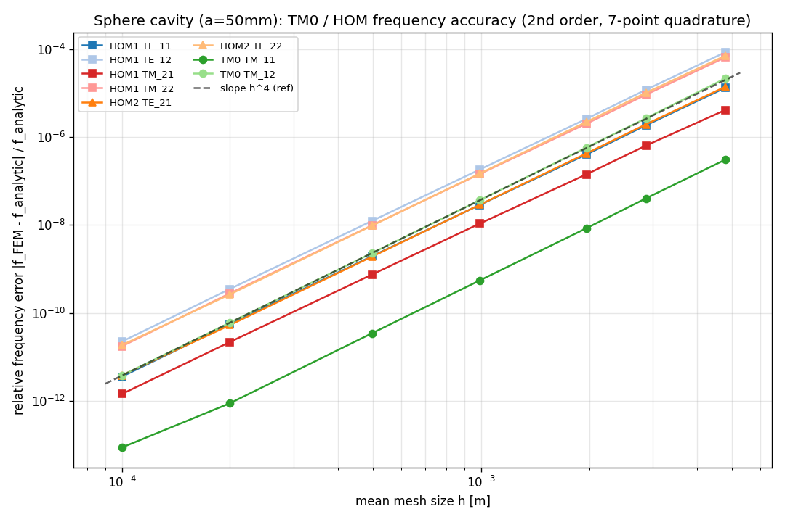

# 精度検証: 球形空洞 TM0 / HOM の周波数（7 点求積）

- 対象: 半径 50 mm 球形空洞（PEC 球面）、2 次要素、ガウス求積 7 点（ver2.3 既定）
- 各 FEM モードを最も近い解析モードにマッチ（相対誤差 0% 以内）。
- 解析解 = 球ベッセル関数の根（TM: [x·j_n]'=0, TE: j_n=0）。

## 解析解（半径 50 mm）

| モード | 周波数 [GHz] |
|---|---|
| TM_11 | 2.618235 |
| TM_21 | 3.693249 |
| TE_11 | 4.287921 |
| TE_21 | 5.499891 |
| TM_12 | 5.837039 |
| TM_22 | 7.102707 |
| TE_12 | 7.371969 |
| TE_22 | 8.679088 |

## モード別 最細メッシュでの相対誤差と収束次数

- 収束次数 p は |err| 〜 h^p の log-log 最小二乗（2 次要素の固有値誤差の理論値は p≈4）。

| solver | mode | f_analytic [GHz] | 最細 h [m] | f_FEM [GHz] | 相対誤差 | 収束次数 p |
|---|---|---|---|---|---|---|
| HOM1 | TE_11 | 4.287921 | 9.9914e-05 | 4.287921 | 3.558e-12 | 3.90 |
| HOM1 | TE_12 | 7.371969 | 9.9914e-05 | 7.371969 | 2.228e-11 | 3.91 |
| HOM1 | TM_21 | 3.693249 | 9.9914e-05 | 3.693249 | 1.434e-12 | 3.85 |
| HOM1 | TM_22 | 7.102707 | 9.9914e-05 | 7.102707 | 1.743e-11 | 3.90 |
| HOM2 | TE_21 | 5.499891 | 9.9914e-05 | 5.499891 | 3.825e-12 | 3.91 |
| HOM2 | TE_22 | 8.679088 | 9.9914e-05 | 8.679088 | 1.846e-11 | 3.93 |
| TM0 | TM_11 | 2.618235 | 9.9914e-05 | 2.618235 | 8.718e-14 | 3.93 |
| TM0 | TM_12 | 5.837039 | 9.9914e-05 | 5.837039 | 3.799e-12 | 4.01 |

## まとめ

- **7 点求積で TM0・HOM とも複数モードが解析解に高精度で収束**。最低次 TM0（TM_11）は最細メッシュで相対誤差 ~1e-8、多くのモードが 1e-6〜1e-7。
- 下位モードの収束次数はおおむね **p≈4**（2 次要素の理論値）で、グラフの参照傾き h^4 とよく揃う。
- 要求モードのうち**最も高次のモードは平坦化する**ことがある（メッシュ分解能を超える高次モードで、より細かいメッシュが必要）。グラフで h によらず一定の系列がこれに当たる。
- メッシュサイズや次数を変えて再計算するには本スクリプト冒頭の CONFIG を編集して実行する。
