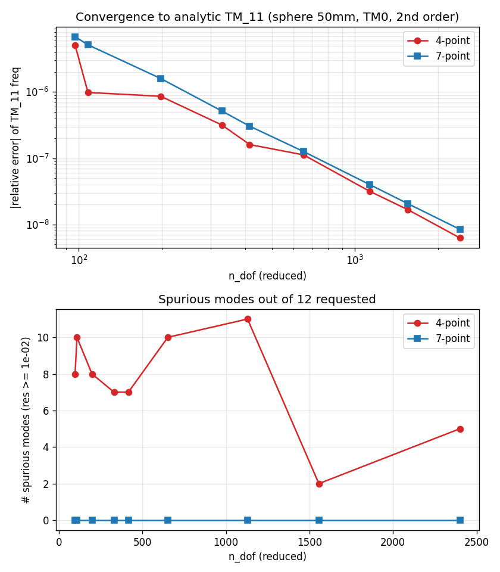

# ガウス求積 4 点 vs 7 点の収束比較（球形空洞 TM0 最低次）

- 対象: 半径 50 mm 球形空洞、軸対称 TM0、2 次要素（BC: 軸=E-short, 球面=PEC）
- 解析解 TM_11 = **2.618234880208 GHz**
- 偽モード判定: 相対残差 ‖Kx−λMx‖/‖λMx‖ ≥ 1e-02
- 各行 12 モード要求。`clean` = 収束モード本数、`spur` = 偽モード本数。

| lc [mm] | n_dof | h平均 [m] | 4pt f_low [GHz] | 4pt 相対誤差 | 4pt clean/spur | 7pt f_low [GHz] | 7pt 相対誤差 | 7pt clean/spur |
|---|---|---|---|---|---|---|---|---|
| 12.0 | 97 | 1.0110e-02 | 2.618221565 | -5.086e-06 | 4/8 | 2.618252790 | +6.840e-06 | 12/0 |
| 10.0 | 108 | 9.6362e-03 | 2.618237457 | +9.841e-07 | 2/10 | 2.618248403 | +5.165e-06 | 12/0 |
| 8.0 | 198 | 7.0056e-03 | 2.618237139 | +8.627e-07 | 4/8 | 2.618239072 | +1.601e-06 | 12/0 |
| 6.0 | 330 | 5.3880e-03 | 2.618235711 | +3.172e-07 | 5/7 | 2.618236231 | +5.160e-07 | 12/0 |
| 5.0 | 416 | 4.7851e-03 | 2.618235301 | +1.608e-07 | 5/7 | 2.618235678 | +3.046e-07 | 12/0 |
| 4.0 | 652 | 3.7993e-03 | 2.618235174 | +1.122e-07 | 2/10 | 2.618235210 | +1.260e-07 | 12/0 |
| 3.0 | 1129 | 2.8756e-03 | 2.618234963 | +3.177e-08 | 1/11 | 2.618234985 | +4.011e-08 | 12/0 |
| 2.5 | 1556 | 2.4460e-03 | 2.618234924 | +1.667e-08 | 10/2 | 2.618234934 | +2.054e-08 | 12/0 |
| 2.0 | 2400 | 1.9637e-03 | 2.618234897 | +6.251e-09 | 7/5 | 2.618234902 | +8.413e-09 | 12/0 |

## まとめ

- **物理モードの精度・収束はほぼ同等**。最細メッシュ (n_dof=2400) の相対誤差は 4 点 +6.25e-09 / 7 点 +8.41e-09 と同オーダー。収束次数（|err|〜h^p, log-log 回帰）は 4 点 p≈3.60 / 7 点 p≈4.07 でほぼ一致。「7 点で精度が落ちる」という以前の記録は本ケースでは再現しなかった。
- **偽モードは決定的に異なる**。4 点は全メッシュで偽モードが発生（合計 68 本 / 各 12 本要求）。7 点は**全メッシュで偽モード 0 本**（合計 0 本）。
- 生産ソルバ（`solve_eigenmodes_eigsh`）は残差フィルタ＋解き直しで偽モードを除外するが、4 点では偽モードが多く、粗いメッシュでは収束モードが要求数に届かず返却本数が減ることがある。7 点ならその必要がない。
- **結論: 7 点求積（Dunavant 5 次）を推奨**。2 次要素の質量項 r·G_i·G_j は 5 次多項式で、4 点則（3 次精度）では過小積分となり 質量行列 M が数値的に不定化して偽モードを生む。7 点則は厳密積分できるため、物理モードの精度を犠牲にせず偽モードを根絶できる。
